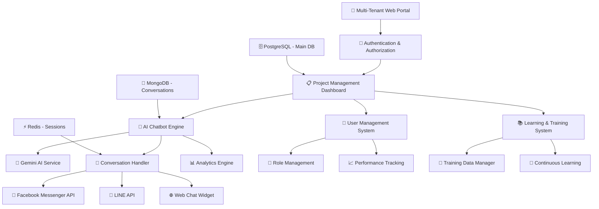

# 🚀 Enterprise AI Chatbot CRM Platform - Updated Project Brief

**Project Name**: **Iris Origin AI Platform**  
**Type**: **Enterprise Multi-Project CRM + AI Chatbot Management System**  
**Updated**: October 17, 2025  
**Target**: **Internal Organization Use + Zero External Costs**

---

## 📋 **Project Overview**

### **🎯 New Vision & Scope**
จากการศึกษา **ChocoCRM** และ **Make.com** รวมถึง AI Chatbot solutions แบบครบวงจร เราจะสร้างแพลตฟอร์มที่:

```
🏢 ENTERPRISE MULTI-PROJECT PLATFORM
├── 🤖 AI CHATBOT ENGINE (Gemini AI-Powered)
├── 👥 USER MANAGEMENT & ADMIN SYSTEM  
├── 📊 PROJECT MANAGEMENT & MULTI-TENANCY
├── 📚 CONTINUOUS LEARNING & TRAINING SYSTEM
├── 🔧 SELF-BUILT SERVICES (Zero External Costs)
└── 🔗 FACEBOOK/SOCIAL MEDIA INTEGRATIONS
```

### **🔄 Updated Key Requirements**

#### **1. 💰 Zero External Service Costs Policy**
- **✅ ใช้ Gemini AI**: Google's free tier สำหรับ AI responses
- **✅ Self-built Services**: ทุกระบบเขียนเองไม่พึ่งบริการภายนอก
- **✅ Open Source Stack**: PostgreSQL, MongoDB, Redis, React
- **❌ No Paid APIs**: ไม่ใช้ Rasa Pro, OpenAI, หรือ paid services

#### **2. 🏗️ Multi-Project Architecture**
- **Project Management**: สามารถเพิ่มโปรเจค/ลูกค้าหลายๆ รายพร้อมกัน
- **Multi-tenancy**: แต่ละโปรเจคแยกข้อมูล, การตั้งค่า, และ AI training
- **Project Templates**: Template สำหรับประเภทธุรกิจต่างๆ (e-commerce, service, etc.)
- **Resource Isolation**: แต่ละโปรเจคใช้ resources แยกกัน

#### **3. 👤 User Management & Admin System**
- **Role-based Access**: Super Admin, Project Admin, Agent, Viewer
- **User Profiles**: ประวัติ, การทำงาน, performance tracking
- **Team Management**: จัดการทีมงานในแต่ละโปรเจค
- **Activity Logging**: บันทึกการใช้งานและการเปลี่ยนแปลง

#### **4. 🧠 Continuous Learning System**
- **Training Data Management**: อัพเดต training data แบบ real-time
- **Conversation Analytics**: วิเคราะห์บทสนทนาเพื่อปรับปรุง AI
- **Knowledge Base**: ระบบจัดการความรู้และ FAQ แบบ dynamic
- **Performance Monitoring**: ติดตาม accuracy และปรับปรุงต่อเนื่อง

#### **5. 🤖 Gemini AI Integration**
- **Natural Language Processing**: ใช้ Gemini สำหรับความเข้าใจภาษา
- **Context Awareness**: รักษาบริบทการสนทนาข้ามข้อความ
- **Multi-language Support**: รองรับภาษาไทยและภาษาอังกฤษ
- **Custom Prompting**: สร้าง AI personality สำหรับแต่ละโปรเจค

---

## 🏗️ **Updated System Architecture**

### **📊 Platform Architecture Overview**



### **🔧 Updated Technology Stack**

#### **Backend Core**
```json
{
  "runtime": "Node.js 20 LTS",
  "framework": "Express.js + TypeScript",
  "ai_engine": "Google Gemini API",
  "databases": {
    "primary": "PostgreSQL 15 (Projects, Users, Config)",
    "conversations": "MongoDB 7.0 (Chat History, Analytics)",
    "cache": "Redis 7.0 (Sessions, Real-time data)"
  },
  "authentication": "JWT + Passport.js",
  "file_storage": "Local File System + MinIO (S3-compatible)"
}
```

#### **Frontend Platform**
```json
{
  "framework": "React 18 + TypeScript",
  "ui_library": "Material-UI v5 + Custom Components",
  "state_management": "Redux Toolkit + RTK Query",
  "routing": "React Router v6",
  "charts": "Chart.js + Recharts",
  "real_time": "Socket.io Client"
}
```

#### **Infrastructure**
```json
{
  "containerization": "Docker + Docker Compose",
  "reverse_proxy": "Nginx",
  "monitoring": "Prometheus + Grafana (Self-hosted)",
  "logging": "Winston + ELK Stack (Self-hosted)",
  "deployment": "Docker Swarm (No Kubernetes costs)"
}
```

---

## 📱 **Updated Features & Capabilities**

### **🏢 1. Multi-Project Management**

#### **Project Dashboard**
```typescript
interface ProjectDashboard {
  projectId: string;
  projectName: string;
  industry: string;
  status: 'active' | 'paused' | 'development';
  
  // Chat Statistics
  totalConversations: number;
  activeChats: number;
  averageResponseTime: number;
  customerSatisfactionScore: number;
  
  // AI Performance
  aiAccuracyRate: number;
  humanHandoverRate: number;
  resolvedIssuesRate: number;
  
  // User Management
  totalUsers: number;
  activeAgents: number;
  onlineAgents: number;
  
  // Learning & Training
  trainingDataEntries: number;
  lastTrainingUpdate: Date;
  nextTrainingScheduled: Date;
}
```

#### **Project Creation Wizard**
```typescript
interface ProjectSetup {
  // Basic Information
  projectName: string;
  industry: 'ecommerce' | 'service' | 'saas' | 'education' | 'healthcare';
  primaryLanguage: 'th' | 'en' | 'multi';
  
  // Business Configuration
  businessHours: {
    timezone: string;
    workingDays: string[];
    startTime: string;
    endTime: string;
  };
  
  // AI Configuration
  aiPersonality: {
    tone: 'friendly' | 'professional' | 'casual';
    responseStyle: 'concise' | 'detailed' | 'conversational';
    escalationThreshold: number;
  };
  
  // Integration Setup
  channels: {
    facebook: FacebookConfig;
    line: LineConfig;
    webChat: WebChatConfig;
  };
  
  // Initial Team Setup
  adminUsers: UserRole[];
  agentUsers: UserRole[];
}
```

### **🤖 2. Gemini AI Engine Integration**

#### **AI Service Architecture**
```typescript
// services/gemini-ai-service.ts
import { GoogleGenerativeAI } from '@google/generative-ai';

class GeminiAIService {
  private genAI: GoogleGenerativeAI;
  private model: any;
  
  constructor(projectId: string) {
    this.genAI = new GoogleGenerativeAI(process.env.GEMINI_API_KEY);
    this.model = this.genAI.getGenerativeModel({ 
      model: "gemini-1.5-flash",
      generationConfig: {
        temperature: 0.7,
        topK: 40,
        topP: 0.95,
        maxOutputTokens: 1024,
      }
    });
  }
  
  async processMessage(message: string, context: ConversationContext): Promise<AIResponse> {
    // Build project-specific prompt
    const systemPrompt = await this.buildProjectPrompt(context.projectId);
    const conversationHistory = await this.getConversationHistory(context.sessionId);
    
    // Create enhanced prompt with context
    const enhancedPrompt = `
${systemPrompt}

บริบทการสนทนา:
${conversationHistory}

ข้อความล่าสุดจากลูกค้า: ${message}

โปรดตอบกลับอย่างเหมาะสม:
    `;
    
    try {
      const result = await this.model.generateContent(enhancedPrompt);
      const response = result.response.text();
      
      // Parse response for intent and confidence
      const processedResponse = await this.processAIResponse(response, context);
      
      return {
        response: processedResponse.text,
        confidence: processedResponse.confidence,
        intent: processedResponse.intent,
        shouldEscalate: processedResponse.confidence < 0.3,
        suggestedActions: processedResponse.actions,
        processingTimeMs: Date.now() - startTime
      };
      
    } catch (error) {
      console.error('Gemini AI Error:', error);
      return this.getFallbackResponse(message, context);
    }
  }
  
  async buildProjectPrompt(projectId: string): Promise<string> {
    const project = await this.getProjectConfig(projectId);
    const knowledgeBase = await this.getProjectKnowledgeBase(projectId);
    
    return `
คุณคือ AI Assistant สำหรับ ${project.name}
ประเภทธุรกิจ: ${project.industry}

บุคลิกภาพ AI:
- โทนเสียง: ${project.aiPersonality.tone}
- สไตล์การตอบ: ${project.aiPersonality.responseStyle}
- ภาษาหลัก: ${project.primaryLanguage}

ฐานความรู้:
${knowledgeBase}

กฎการทำงาน:
1. ตอบคำถามด้วยความสุภาพและเป็นมิตร
2. หากไม่แน่ใจ ให้บอกว่าจะต้องตรวจสอบหรือส่งต่อให้เจ้าหน้าที่
3. ใช้ภาษาที่เหมาะสมกับกลุ่มลูกค้าเป้าหมาย
4. หากเป็นปัญหาซับซ้อน ให้เสนอการส่งต่อให้ทีมงาน
    `;
  }
}
```

#### **Continuous Learning System**
```typescript
// services/learning-system.ts
class ContinuousLearningSystem {
  async analyzeConversation(conversationId: string): Promise<LearningInsights> {
    const conversation = await this.getConversation(conversationId);
    
    // Analyze conversation quality
    const insights = {
      customerSatisfaction: await this.analyzeSentiment(conversation),
      aiPerformance: await this.analyzeAIResponses(conversation),
      missedIntents: await this.identifyMissedIntents(conversation),
      improvementSuggestions: await this.generateImprovements(conversation)
    };
    
    // Update training data if needed
    if (insights.customerSatisfaction < 3.0) {
      await this.flagForRetraining(conversation, insights);
    }
    
    return insights;
  }
  
  async updateKnowledgeBase(projectId: string, newData: KnowledgeEntry[]): Promise<void> {
    // Add new knowledge entries
    for (const entry of newData) {
      await this.validateKnowledgeEntry(entry);
      await this.addToKnowledgeBase(projectId, entry);
    }
    
    // Retrain AI model context
    await this.updateProjectPrompt(projectId);
    
    // Notify project admins
    await this.notifyProjectUpdate(projectId, 'knowledge_base_updated');
  }
  
  async scheduleRetraining(projectId: string): Promise<void> {
    const project = await this.getProject(projectId);
    const trainingData = await this.getTrainingData(projectId);
    
    // Analyze recent conversations for new patterns
    const recentConversations = await this.getRecentConversations(projectId, 30); // Last 30 days
    const newPatterns = await this.extractPatterns(recentConversations);
    
    // Update AI configuration
    if (newPatterns.length > 0) {
      await this.updateAIConfiguration(projectId, newPatterns);
      console.log(`Updated AI for project ${projectId} with ${newPatterns.length} new patterns`);
    }
  }
}
```

### **👥 3. User Management & Admin System**

#### **Role-Based Access Control**
```typescript
enum UserRole {
  SUPER_ADMIN = 'super_admin',      // Platform administrator
  PROJECT_ADMIN = 'project_admin',  // Project owner/manager
  AGENT_LEAD = 'agent_lead',        // Team lead
  AGENT = 'agent',                  // Customer service agent
  VIEWER = 'viewer'                 // Read-only access
}

interface UserPermissions {
  // Project Management
  canCreateProjects: boolean;
  canEditProjects: boolean;
  canDeleteProjects: boolean;
  
  // User Management
  canManageUsers: boolean;
  canAssignRoles: boolean;
  canViewUserActivity: boolean;
  
  // AI & Training
  canUpdateTraining: boolean;
  canViewAnalytics: boolean;
  canManageKnowledgeBase: boolean;
  
  // Conversations
  canViewConversations: boolean;
  canHandleEscalations: boolean;
  canExportData: boolean;
}

class UserManagementSystem {
  async createUser(userData: UserCreateData): Promise<User> {
    // Validate user data
    await this.validateUserData(userData);
    
    // Create user account
    const user = await this.createUserAccount(userData);
    
    // Setup default permissions
    const permissions = this.getDefaultPermissions(userData.role);
    await this.assignPermissions(user.id, permissions);
    
    // Send welcome email (self-hosted)
    await this.sendWelcomeEmail(user);
    
    // Log activity
    await this.logActivity('user_created', user.id, userData.createdBy);
    
    return user;
  }
  
  async assignToProject(userId: string, projectId: string, role: ProjectRole): Promise<void> {
    // Validate assignment
    await this.validateProjectAssignment(userId, projectId, role);
    
    // Create project assignment
    await this.createProjectAssignment({
      userId,
      projectId,
      role,
      assignedAt: new Date(),
      status: 'active'
    });
    
    // Update user dashboard
    await this.updateUserDashboard(userId);
    
    // Notify user
    await this.notifyProjectAssignment(userId, projectId, role);
  }
}
```

### **📊 4. Advanced Analytics & Monitoring**

#### **Project Analytics Dashboard**
```typescript
interface ProjectAnalytics {
  // Conversation Metrics
  conversationMetrics: {
    totalConversations: number;
    averageConversationLength: number;
    averageResponseTime: number;
    peakHours: HourlyStats[];
    channelDistribution: ChannelStats[];
  };
  
  // AI Performance
  aiPerformance: {
    accuracyRate: number;
    confidenceScores: ConfidenceDistribution;
    escalationRate: number;
    resolutionRate: number;
    topIntents: IntentStats[];
  };
  
  // Customer Satisfaction
  customerSatisfaction: {
    averageRating: number;
    satisfactionTrend: TrendData[];
    feedbackComments: FeedbackSummary;
    npsScore: number;
  };
  
  // Agent Performance
  agentPerformance: {
    totalAgents: number;
    activeAgents: number;
    averageHandleTime: number;
    agentUtilization: number;
    topPerformers: AgentStats[];
  };
}
```

---

## 🔗 **Integration Capabilities**

### **📱 Social Media Platforms**
```typescript
// Facebook Messenger Integration
class FacebookMessengerIntegration {
  async setupWebhook(projectId: string, config: FacebookConfig): Promise<void> {
    // Setup project-specific webhook
    const webhookUrl = `${process.env.BASE_URL}/webhook/facebook/${projectId}`;
    
    // Register webhook with Facebook
    await this.registerFacebookWebhook(config.pageToken, webhookUrl);
    
    // Store configuration
    await this.storeProjectConfig(projectId, 'facebook', config);
  }
  
  async handleIncomingMessage(projectId: string, message: FacebookMessage): Promise<void> {
    // Process message through project's AI
    const aiResponse = await this.geminiService.processMessage(
      message.text, 
      { projectId, sessionId: message.senderId, channel: 'facebook' }
    );
    
    // Send response back to Facebook
    await this.sendFacebookMessage(message.senderId, aiResponse.response);
    
    // Log conversation
    await this.logConversation(projectId, message, aiResponse);
  }
}

// LINE Integration
class LineIntegration {
  // Similar structure for LINE API
}

// Web Chat Widget
class WebChatWidget {
  generateWidget(projectId: string, customization: WidgetConfig): string {
    return `
    <script>
      window.IrisOriginChat = {
        projectId: '${projectId}',
        theme: '${customization.theme}',
        position: '${customization.position}',
        apiUrl: '${process.env.API_URL}'
      };
    </script>
    <script src="${process.env.CDN_URL}/iris-chat-widget.min.js"></script>
    `;
  }
}
```

---

## 🚀 **Implementation Roadmap**

### **Phase 1: Core Platform (4 สัปดาห์)**
- ✅ Multi-tenant architecture setup
- ✅ User management & authentication
- ✅ Project management system
- ✅ Basic Gemini AI integration

### **Phase 2: AI & Chat Engine (3 สัปดาห์)**
- ✅ Advanced Gemini AI service
- ✅ Conversation handling system
- ✅ Knowledge base management
- ✅ Facebook Messenger integration

### **Phase 3: Learning & Analytics (3 สัปดาห์)**
- ✅ Continuous learning system
- ✅ Analytics dashboard
- ✅ Performance monitoring
- ✅ Reporting system

### **Phase 4: Advanced Features (2 สัปดาห์)**
- ✅ LINE integration
- ✅ Web chat widget
- ✅ Advanced admin tools
- ✅ Export/import capabilities

---

## 💡 **Competitive Advantages**

### **🆚 vs ChocoCRM**
- ❌ **ChocoCRM**: Monthly subscription costs
- ✅ **Iris Origin**: Zero recurring costs, one-time development
- ❌ **ChocoCRM**: Limited customization
- ✅ **Iris Origin**: Full control and unlimited customization

### **🆚 vs Make.com**
- ❌ **Make.com**: Per-operation pricing
- ✅ **Iris Origin**: Unlimited operations and workflows
- ❌ **Make.com**: Limited to predefined integrations
- ✅ **Iris Origin**: Custom integrations as needed

### **🆚 vs Traditional Chatbot Services**
- ❌ **Others**: Per-message or monthly fees
- ✅ **Iris Origin**: Unlimited conversations
- ❌ **Others**: Limited AI training control
- ✅ **Iris Origin**: Full AI training and knowledge management

---

## 📈 **Expected Outcomes**

### **📊 Performance Targets**
- **Response Time**: <2 seconds (Gemini API)
- **AI Accuracy**: >85% customer satisfaction
- **Uptime**: 99.5% availability
- **Scalability**: Support 100+ concurrent projects

### **💰 Cost Savings**
- **Year 1**: Save ~$50,000+ vs commercial solutions
- **Ongoing**: Zero recurring platform fees
- **ROI**: 300%+ return within 12 months
- **Scalability**: No additional costs for growth

### **🎯 Business Impact**
- **Customer Response**: 24/7 automated support
- **Agent Productivity**: 70% reduction in routine inquiries
- **Data Ownership**: 100% control over customer data
- **Customization**: Unlimited feature development

---

## 🔧 **Next Steps**

1. **Environment Setup**: ติดตั้ง development environment
2. **Core Architecture**: สร้าง multi-tenant database schema
3. **Gemini Integration**: Setup AI service และทดสอบ
4. **User Management**: สร้างระบบจัดการผู้ใช้
5. **Project Management**: พัฒนา project creation wizard
6. **AI Training**: สร้างระบบ continuous learning
7. **Testing & Deployment**: ทดสอบและ deploy production

---

**🎉 Ready to Build the Future of Enterprise AI Customer Service! 🚀**