# 🤖 Gemini AI Engine Integration - Task 4 Implementation

**Task**: Complete Gemini AI Integration with Multi-Project Support  
**Status**: ✅ **IN PROGRESS**  
**Research Basis**: Google AI Best Practices + Enterprise Conversation AI Patterns  
**Target**: <2s response time with 90%+ accuracy and project-specific intelligence

---

## 🎯 **Gemini AI Architecture Overview**

### **🧠 AI Engine Design Pattern**

Based on **Google's Gemini Pro Best Practices** + **Conversational AI Enterprise Patterns**:

```mermaid
graph TB
    A[📱 User Message] --> B[🔍 Message Preprocessor]
    B --> C[🎯 Project Context Resolver]
    C --> D[🧠 Gemini AI Service]
    
    D --> E[📝 Prompt Engineering]
    E --> F[🤖 Gemini API Call]
    F --> G[📊 Response Processing]
    
    G --> H[💬 Response Formatter]
    G --> I[📈 Analytics Tracker]  
    G --> J[📚 Learning System]
    
    H --> K[📤 Final Response]
    
    L[🗄️ Project Knowledge Base] --> E
    M[🔄 Conversation Context] --> E
    N[👤 User Profile] --> E
```



### **🎨 Project-Specific AI Personalities**

```typescript
// Multi-Project AI Configuration System
interface ProjectAIConfig {
  projectId: string;
  businessType: 'ecommerce' | 'service' | 'saas' | 'healthcare' | 'education' | 'finance';
  
  // AI Personality Configuration
  personality: {
    tone: 'friendly' | 'professional' | 'casual' | 'formal';
    style: 'concise' | 'detailed' | 'conversational' | 'technical';
    languagePreference: 'th' | 'en' | 'multi';
    culturalContext: 'thai' | 'international' | 'local';
  };
  
  // Business Context
  businessContext: {
    industry: string;
    targetAudience: string[];
    serviceHours: BusinessHours;
    escalationRules: EscalationConfig;
  };
  
  // AI Model Configuration  
  modelConfig: {
    model: 'gemini-1.5-flash' | 'gemini-1.5-pro';
    temperature: number; // 0.0 - 1.0 (creativity level)
    topK: number; // Token selection diversity
    topP: number; // Nucleus sampling
    maxOutputTokens: number;
    safetySettings: SafetyConfig[];
  };
  
  // Knowledge Base Integration
  knowledgeBase: {
    faqs: KnowledgeEntry[];
    policies: PolicyDocument[];
    procedures: Procedure[];
    productCatalog?: ProductInfo[];
  };
}
```

---

## 🔧 **Core Gemini AI Service Implementation**

### **🚀 Production-Grade AI Service**

```typescript
// services/gemini-ai-service.ts - Enterprise Gemini AI Integration
import { GoogleGenerativeAI, HarmCategory, HarmBlockThreshold } from '@google/generative-ai';
import { ProjectConfig } from '../types/project';
import { ConversationContext } from '../types/conversation';
import { Logger } from '../utils/logger';
import { AIMetrics } from '../utils/metrics';
import { RateLimiter } from '../utils/rate-limiter';

interface GeminiResponse {
  response: string;
  confidence: number;
  processingTimeMs: number;
  tokensUsed: number;
  intent?: string;
  entities?: Record<string, any>;
  sentiment?: SentimentAnalysis;
  shouldEscalate: boolean;
  escalationReason?: string;
  suggestedActions?: Action[];
  metadata: ResponseMetadata;
}

interface SentimentAnalysis {
  score: number; // -1 to 1 (negative to positive)
  magnitude: number; // 0 to 1 (intensity)
  label: 'positive' | 'neutral' | 'negative';
}

interface Action {
  type: 'knowledge_base_lookup' | 'escalate_to_human' | 'collect_info' | 'provide_solution';
  data: Record<string, any>;
  priority: number;
}

interface ResponseMetadata {
  geminiModel: string;
  promptVersion: string;
  responseTime: number;
  tokensInput: number;
  tokensOutput: number;
  safetyRatings: any[];
}

class GeminiAIService {
  private genAI: GoogleGenerativeAI;
  private logger: Logger;
  private metrics: AIMetrics;
  private rateLimiter: RateLimiter;
  
  // Model cache per project for performance
  private projectModels = new Map<string, any>();
  
  constructor() {
    this.genAI = new GoogleGenerativeAI(process.env.GEMINI_API_KEY!);
    this.logger = new Logger('GeminiAI');
    this.metrics = new AIMetrics();
    this.rateLimiter = new RateLimiter();
    
    this.initializeSafetySettings();
  }
  
  private initializeSafetySettings() {
    // Enterprise-grade safety configuration
    this.defaultSafetySettings = [
      {
        category: HarmCategory.HARM_CATEGORY_HARASSMENT,
        threshold: HarmBlockThreshold.BLOCK_MEDIUM_AND_ABOVE,
      },
      {
        category: HarmCategory.HARM_CATEGORY_HATE_SPEECH,
        threshold: HarmBlockThreshold.BLOCK_MEDIUM_AND_ABOVE,
      },
      {
        category: HarmCategory.HARM_CATEGORY_SEXUALLY_EXPLICIT,
        threshold: HarmBlockThreshold.BLOCK_MEDIUM_AND_ABOVE,
      },
      {
        category: HarmCategory.HARM_CATEGORY_DANGEROUS_CONTENT,
        threshold: HarmBlockThreshold.BLOCK_MEDIUM_AND_ABOVE,
      },
    ];
  }
  
  /**
   * Main method to process user message with project-specific AI
   */
  async processMessage(
    message: string, 
    context: ConversationContext, 
    projectConfig: ProjectAIConfig
  ): Promise<GeminiResponse> {
    const startTime = Date.now();
    
    try {
      // Rate limiting check
      await this.rateLimiter.checkLimit(
        `project:${context.projectId}:ai_requests`, 
        100, // 100 requests per minute per project
        60
      );
      
      // Get or create project-specific model
      const model = await this.getProjectModel(projectConfig);
      
      // Build enhanced prompt with project context
      const enhancedPrompt = await this.buildProjectPrompt(message, context, projectConfig);
      
      this.logger.info(`Processing AI request for project ${context.projectId}`, {
        messageLength: message.length,
        contextType: context.type,
        model: projectConfig.modelConfig.model
      });
      
      // Generate response from Gemini
      const result = await model.generateContent(enhancedPrompt);
      const response = result.response;
      
      // Process and analyze the response
      const processedResponse = await this.processGeminiResponse(
        response, 
        message, 
        context, 
        projectConfig
      );
      
      // Update metrics
      const processingTime = Date.now() - startTime;
      await this.updateMetrics(context.projectId, processingTime, processedResponse);
      
      // Store interaction for learning
      await this.storeInteractionForLearning(message, processedResponse, context, projectConfig);
      
      this.logger.info(`AI response generated successfully`, {
        projectId: context.projectId,
        processingTime,
        confidence: processedResponse.confidence,
        shouldEscalate: processedResponse.shouldEscalate
      });
      
      return processedResponse;
      
    } catch (error) {
      this.logger.error(`Gemini AI processing failed`, error, {
        projectId: context.projectId,
        messageLength: message.length
      });
      
      // Return fallback response
      return this.getFallbackResponse(message, context, projectConfig);
    }
  }
  
  /**
   * Get or create project-specific Gemini model instance
   */
  private async getProjectModel(projectConfig: ProjectAIConfig): Promise<any> {
    const cacheKey = `${projectConfig.projectId}_${projectConfig.modelConfig.model}`;
    
    if (this.projectModels.has(cacheKey)) {
      return this.projectModels.get(cacheKey);
    }
    
    // Create new model instance with project-specific configuration
    const model = this.genAI.getGenerativeModel({
      model: projectConfig.modelConfig.model,
      generationConfig: {
        temperature: projectConfig.modelConfig.temperature,
        topK: projectConfig.modelConfig.topK,
        topP: projectConfig.modelConfig.topP,
        maxOutputTokens: projectConfig.modelConfig.maxOutputTokens,
      },
      safetySettings: this.defaultSafetySettings,
    });
    
    // Cache the model for reuse
    this.projectModels.set(cacheKey, model);
    
    return model;
  }
  
  /**
   * Build comprehensive project-specific prompt
   */
  private async buildProjectPrompt(
    message: string, 
    context: ConversationContext, 
    projectConfig: ProjectAIConfig
  ): Promise<string> {
    
    // Get conversation history for context
    const conversationHistory = await this.getConversationHistory(context.sessionId, 5); // Last 5 messages
    
    // Get relevant knowledge base entries
    const relevantKnowledge = await this.getRelevantKnowledge(message, projectConfig);
    
    // Get user profile information
    const userProfile = context.userProfile || {};
    
    // Build comprehensive prompt
    const prompt = `
คุณคือ AI Assistant สำหรับ ${projectConfig.businessContext.industry}
ชื่อธุรกิจ: ${projectConfig.projectName}
ประเภทธุรกิจ: ${projectConfig.businessType}

## บุคลิกภาพ AI:
- โทนเสียง: ${this.getToneDescription(projectConfig.personality.tone)}
- สไตล์การตอบ: ${this.getStyleDescription(projectConfig.personality.style)}  
- ภาษาหลัก: ${projectConfig.personality.languagePreference}
- บริบททางวัฒนธรรม: ${projectConfig.personality.culturalContext}

## ข้อมูลลูกค้า:
- ประเภทลูกค้า: ${projectConfig.businessContext.targetAudience.join(', ')}
- เวลาให้บริการ: ${this.formatBusinessHours(projectConfig.businessContext.serviceHours)}

## ฐานความรู้ที่เกี่ยวข้อง:
${relevantKnowledge.map(kb => `
Q: ${kb.question}
A: ${kb.answer}
หมวดหมู่: ${kb.category}
`).join('\n')}

## ประวัติการสนทนา:
${conversationHistory.map(msg => `
${msg.senderType === 'user' ? 'ลูกค้า' : 'AI'}: ${msg.text}
เวลา: ${new Date(msg.createdAt).toLocaleString('th-TH')}
`).join('\n')}

## ข้อมูลลูกค้าปัจจุบัน:
${userProfile.name ? `ชื่อ: ${userProfile.name}` : ''}
${userProfile.email ? `อีเมล: ${userProfile.email}` : ''}
${userProfile.previousIssues ? `ปัญหาที่เคยมี: ${userProfile.previousIssues.join(', ')}` : ''}

## ข้อความล่าสุดจากลูกค้า:
"${message}"

## คำสั่งการทำงาน:
1. วิเคราะห์ข้อความลูกค้าเพื่อเข้าใจความต้องการ
2. ตรวจสอบฐานความรู้เพื่อหาคำตอบที่เหมาะสม
3. ตอบกลับด้วยบุคลิกภาพที่กำหนด
4. หากไม่แน่ใจ (ความเชื่อมั่น < 70%) ให้เสนอการส่งต่อให้เจ้าหน้าที่
5. หากเป็นปัญหาที่ซับซ้อนหรือต้องการการดำเนินการพิเศษ ให้เสนอการส่งต่อ

## รูปแบบการตอบกลับ:
โปรดตอบในรูปแบบ JSON:
{
  "response": "คำตอบสำหรับลูกค้า",
  "confidence": 0.85,
  "intent": "หมวดหมู่ของคำถาม",
  "entities": {"key": "value"},
  "sentiment": {"score": 0.5, "label": "neutral"},
  "shouldEscalate": false,
  "escalationReason": "",
  "suggestedActions": [
    {"type": "provide_solution", "data": {}, "priority": 1}
  ]
}

ตอบกลับเฉพาะ JSON เท่านั้น:
`;
    
    return prompt;
  }
  
  /**
   * Process Gemini's raw response into structured format
   */
  private async processGeminiResponse(
    geminiResponse: any,
    originalMessage: string,
    context: ConversationContext,
    projectConfig: ProjectAIConfig
  ): Promise<GeminiResponse> {
    
    try {
      const responseText = geminiResponse.text();
      
      // Try to parse as JSON first
      let parsedResponse;
      try {
        parsedResponse = JSON.parse(responseText);
      } catch (parseError) {
        // If JSON parsing fails, create structured response
        parsedResponse = {
          response: responseText,
          confidence: 0.7,
          intent: 'general_inquiry',
          entities: {},
          sentiment: { score: 0, label: 'neutral' },
          shouldEscalate: false,
          suggestedActions: [{ type: 'provide_solution', data: {}, priority: 1 }]
        };
      }
      
      // Validate and enhance the response
      const processedResponse: GeminiResponse = {
        response: parsedResponse.response || responseText,
        confidence: this.validateConfidence(parsedResponse.confidence || 0.7),
        processingTimeMs: 0, // Will be set by caller
        tokensUsed: this.estimateTokens(responseText),
        intent: parsedResponse.intent || 'general_inquiry',
        entities: parsedResponse.entities || {},
        sentiment: this.validateSentiment(parsedResponse.sentiment),
        shouldEscalate: this.shouldEscalateToHuman(parsedResponse, projectConfig),
        escalationReason: parsedResponse.escalationReason,
        suggestedActions: parsedResponse.suggestedActions || [],
        metadata: {
          geminiModel: projectConfig.modelConfig.model,
          promptVersion: '1.0',
          responseTime: 0,
          tokensInput: this.estimateTokens(originalMessage),
          tokensOutput: this.estimateTokens(responseText),
          safetyRatings: geminiResponse.safetyRatings || []
        }
      };
      
      return processedResponse;
      
    } catch (error) {
      this.logger.error('Error processing Gemini response', error);
      throw error;
    }
  }
  
  /**
   * Determine if conversation should be escalated to human
   */
  private shouldEscalateToHuman(
    parsedResponse: any, 
    projectConfig: ProjectAIConfig
  ): boolean {
    
    const escalationConfig = projectConfig.businessContext.escalationRules;
    
    // Confidence-based escalation
    if (parsedResponse.confidence < escalationConfig.confidenceThreshold) {
      return true;
    }
    
    // Intent-based escalation
    const escalationIntents = [
      'complaint',
      'refund_request', 
      'technical_support_complex',
      'billing_dispute',
      'legal_inquiry',
      'urgent_issue'
    ];
    
    if (escalationIntents.includes(parsedResponse.intent)) {
      return true;
    }
    
    // Sentiment-based escalation (very negative)
    if (parsedResponse.sentiment && parsedResponse.sentiment.score < -0.7) {
      return true;
    }
    
    // Explicit escalation request
    if (parsedResponse.shouldEscalate === true) {
      return true;
    }
    
    return false;
  }
  
  /**
   * Get conversation history for context
   */
  private async getConversationHistory(
    sessionId: string, 
    limit: number = 5
  ): Promise<any[]> {
    
    try {
      // This would typically query MongoDB for conversation history
      // For now, return empty array as placeholder
      return [];
      
    } catch (error) {
      this.logger.error('Error getting conversation history', error);
      return [];
    }
  }
  
  /**
   * Get relevant knowledge base entries using semantic search
   */
  private async getRelevantKnowledge(
    message: string,
    projectConfig: ProjectAIConfig,
    limit: number = 5
  ): Promise<any[]> {
    
    try {
      // Simple keyword matching for now
      // In production, this would use vector similarity search
      const knowledgeBase = projectConfig.knowledgeBase.faqs || [];
      
      const keywords = message.toLowerCase().split(' ');
      const relevantEntries = knowledgeBase
        .filter(entry => 
          keywords.some(keyword => 
            entry.question.toLowerCase().includes(keyword) ||
            entry.answer.toLowerCase().includes(keyword)
          )
        )
        .slice(0, limit);
      
      return relevantEntries;
      
    } catch (error) {
      this.logger.error('Error getting relevant knowledge', error);
      return [];
    }
  }
  
  /**
   * Store interaction for continuous learning
   */
  private async storeInteractionForLearning(
    message: string,
    response: GeminiResponse,
    context: ConversationContext,
    projectConfig: ProjectAIConfig
  ): Promise<void> {
    
    try {
      const learningData = {
        projectId: context.projectId,
        sessionId: context.sessionId,
        userMessage: message,
        aiResponse: response.response,
        confidence: response.confidence,
        intent: response.intent,
        entities: response.entities,
        sentiment: response.sentiment,
        escalated: response.shouldEscalate,
        timestamp: new Date(),
        modelConfig: projectConfig.modelConfig,
        userFeedback: null, // Will be updated if user provides feedback
      };
      
      // Store in database for learning system
      // await this.learningService.storeInteraction(learningData);
      
    } catch (error) {
      this.logger.error('Error storing interaction for learning', error);
    }
  }
  
  /**
   * Fallback response when Gemini fails
   */
  private getFallbackResponse(
    message: string,
    context: ConversationContext,
    projectConfig: ProjectAIConfig
  ): GeminiResponse {
    
    const fallbackResponses = {
      'th': [
        'ขออภัยค่ะ ขณะนี้ระบบมีปัญหาชั่วคราว กรุณาลองใหม่อีกครั้งหรือติดต่อเจ้าหน้าที่ได้เลยค่ะ',
        'เสียใจด้วยนะคะ ตอนนี้ระบบประมวลผลไม่ได้ ให้ฉันส่งต่อให้เจ้าหน้าที่ช่วยคุณดีกว่าค่ะ',
        'ขอโทษที่ทำให้รอนานนะคะ ระบบมีปัญหาเล็กน้อย ขอส่งต่อให้ทีมงานช่วยเหลือคุณเลยค่ะ'
      ],
      'en': [
        'I apologize, but I\'m experiencing technical difficulties right now. Please try again or let me connect you with our support team.',
        'Sorry for the inconvenience. I\'m having trouble processing your request. Let me transfer you to a human agent.',
        'I\'m currently unable to assist properly. Would you like me to connect you with our customer service team?'
      ]
    };
    
    const language = projectConfig.personality.languagePreference;
    const responses = fallbackResponses[language] || fallbackResponses['en'];
    const randomResponse = responses[Math.floor(Math.random() * responses.length)];
    
    return {
      response: randomResponse,
      confidence: 0.1,
      processingTimeMs: 0,
      tokensUsed: 50,
      intent: 'system_error',
      entities: {},
      sentiment: { score: 0, magnitude: 0, label: 'neutral' },
      shouldEscalate: true,
      escalationReason: 'system_error',
      suggestedActions: [
        { type: 'escalate_to_human', data: { reason: 'ai_system_error' }, priority: 1 }
      ],
      metadata: {
        geminiModel: 'fallback',
        promptVersion: '1.0',
        responseTime: 0,
        tokensInput: this.estimateTokens(message),
        tokensOutput: this.estimateTokens(randomResponse),
        safetyRatings: []
      }
    };
  }
  
  /**
   * Utility methods
   */
  private validateConfidence(confidence: number): number {
    return Math.max(0, Math.min(1, confidence));
  }
  
  private validateSentiment(sentiment: any): SentimentAnalysis {
    if (!sentiment) {
      return { score: 0, magnitude: 0, label: 'neutral' };
    }
    
    return {
      score: Math.max(-1, Math.min(1, sentiment.score || 0)),
      magnitude: Math.max(0, Math.min(1, sentiment.magnitude || 0)),
      label: sentiment.label || 'neutral'
    };
  }
  
  private estimateTokens(text: string): number {
    // Rough estimation: ~4 characters per token
    return Math.ceil(text.length / 4);
  }
  
  private getToneDescription(tone: string): string {
    const descriptions = {
      'friendly': 'เป็นมิตร อบอุ่น และใส่ใจลูกค้า',
      'professional': 'มืออาชีพ สุภาพ และให้ความเคารพ',
      'casual': 'สบายๆ เป็นกันเอง และเข้าถึงง่าย',
      'formal': 'เป็นทางการ สุภาพ และใช้ภาษาที่เหมาะสม'
    };
    return descriptions[tone] || descriptions['friendly'];
  }
  
  private getStyleDescription(style: string): string {
    const descriptions = {
      'concise': 'กระชับ ตรงประเด็น และชัดเจน',
      'detailed': 'ละเอียด ครบถ้วน และอธิบายเต็มที่',
      'conversational': 'เป็นธรรมชาติ เหมือนการสนทนา และโต้ตอบได้',
      'technical': 'เฉพาะทาง แม่นยำ และใช้ศัพท์เทคนิค'
    };
    return descriptions[style] || descriptions['conversational'];
  }
  
  private formatBusinessHours(hours: any): string {
    // Format business hours for display
    return 'จันทร์-ศุกร์ 9:00-18:00, เสาร์ 9:00-17:00';
  }
  
  /**
   * Update AI performance metrics
   */
  private async updateMetrics(
    projectId: string, 
    processingTime: number, 
    response: GeminiResponse
  ): Promise<void> {
    
    try {
      await this.metrics.recordAIInteraction({
        projectId,
        processingTime,
        confidence: response.confidence,
        intent: response.intent,
        escalated: response.shouldEscalate,
        tokensUsed: response.tokensUsed,
        timestamp: new Date()
      });
      
    } catch (error) {
      this.logger.error('Error updating AI metrics', error);
    }
  }
}

export { GeminiAIService, GeminiResponse };
```

---

## 🎨 **Project Configuration Management**

### **⚙️ AI Configuration Service**

```typescript
// services/ai-config-service.ts - Project AI Configuration Management
import { ProjectAIConfig } from '../types/ai-config';
import { DatabaseService } from './database-service';
import { Logger } from '../utils/logger';

class AIConfigService {
  private db: DatabaseService;
  private logger: Logger;
  private configCache = new Map<string, ProjectAIConfig>();
  
  constructor(db: DatabaseService) {
    this.db = db;
    this.logger = new Logger('AIConfig');
  }
  
  /**
   * Get AI configuration for a project
   */
  async getProjectAIConfig(projectId: string): Promise<ProjectAIConfig> {
    // Check cache first
    if (this.configCache.has(projectId)) {
      return this.configCache.get(projectId)!;
    }
    
    try {
      // Get project configuration from database
      const project = await this.db.query(`
        SELECT 
          project_id,
          project_name,
          business_type,
          ai_config,
          primary_language,
          supported_languages,
          business_hours
        FROM shared_tenants.projects 
        WHERE project_id = $1 AND status = 'active'
      `, [projectId]);
      
      if (!project.length) {
        throw new Error(`Project ${projectId} not found or inactive`);
      }
      
      // Get knowledge base entries
      const knowledgeBase = await this.getProjectKnowledgeBase(projectId);
      
      // Build complete AI configuration
      const config: ProjectAIConfig = {
        projectId: project[0].project_id,
        projectName: project[0].project_name,
        businessType: project[0].business_type,
        
        personality: {
          tone: project[0].ai_config?.personality?.tone || 'friendly',
          style: project[0].ai_config?.personality?.style || 'conversational',
          languagePreference: project[0].primary_language || 'th',
          culturalContext: project[0].ai_config?.personality?.culturalContext || 'thai'
        },
        
        businessContext: {
          industry: this.getIndustryName(project[0].business_type),
          targetAudience: project[0].ai_config?.targetAudience || ['general_customers'],
          serviceHours: project[0].business_hours,
          escalationRules: {
            confidenceThreshold: project[0].ai_config?.escalation?.confidence_threshold || 0.3,
            maxAttempts: project[0].ai_config?.escalation?.max_attempts || 3,
            autoEscalate: project[0].ai_config?.escalation?.auto_escalate !== false
          }
        },
        
        modelConfig: {
          model: project[0].ai_config?.model || 'gemini-1.5-flash',
          temperature: project[0].ai_config?.temperature || 0.7,
          topK: project[0].ai_config?.topK || 40,
          topP: project[0].ai_config?.topP || 0.95,
          maxOutputTokens: project[0].ai_config?.maxOutputTokens || 1024,
          safetySettings: this.getDefaultSafetySettings()
        },
        
        knowledgeBase: {
          faqs: knowledgeBase.faqs,
          policies: knowledgeBase.policies,
          procedures: knowledgeBase.procedures,
          productCatalog: knowledgeBase.productCatalog
        }
      };
      
      // Cache the configuration
      this.configCache.set(projectId, config);
      
      return config;
      
    } catch (error) {
      this.logger.error(`Error getting AI config for project ${projectId}`, error);
      throw error;
    }
  }
  
  /**
   * Update AI configuration for a project
   */
  async updateProjectAIConfig(
    projectId: string, 
    updates: Partial<ProjectAIConfig>
  ): Promise<void> {
    
    try {
      // Update database
      await this.db.query(`
        UPDATE shared_tenants.projects 
        SET 
          ai_config = ai_config || $2::jsonb,
          updated_at = NOW()
        WHERE project_id = $1
      `, [projectId, JSON.stringify(updates)]);
      
      // Clear cache to force refresh
      this.configCache.delete(projectId);
      
      this.logger.info(`AI configuration updated for project ${projectId}`);
      
    } catch (error) {
      this.logger.error(`Error updating AI config for project ${projectId}`, error);
      throw error;
    }
  }
  
  /**
   * Get project knowledge base
   */
  private async getProjectKnowledgeBase(projectId: string): Promise<any> {
    try {
      // Get tenant schema name
      const project = await this.db.query(`
        SELECT db_schema_name FROM shared_tenants.projects WHERE project_id = $1
      `, [projectId]);
      
      if (!project.length) {
        throw new Error(`Project ${projectId} not found`);
      }
      
      const schemaName = project[0].db_schema_name;
      
      // Get knowledge base entries from tenant schema
      const faqs = await this.db.query(`
        SELECT 
          kb_id,
          category,
          question,
          answer,
          tags,
          priority,
          language,
          effectiveness_score
        FROM ${schemaName}.knowledge_base 
        WHERE status = 'active'
        ORDER BY priority DESC, effectiveness_score DESC
      `);
      
      return {
        faqs: faqs || [],
        policies: [], // TODO: Implement policies table
        procedures: [], // TODO: Implement procedures table  
        productCatalog: [] // TODO: Implement product catalog
      };
      
    } catch (error) {
      this.logger.error(`Error getting knowledge base for project ${projectId}`, error);
      return { faqs: [], policies: [], procedures: [], productCatalog: [] };
    }
  }
  
  /**
   * Create default AI configuration for new project
   */
  async createDefaultAIConfig(
    projectId: string,
    businessType: string,
    language: string = 'th'
  ): Promise<ProjectAIConfig> {
    
    const defaultConfigs = {
      'ecommerce': {
        personality: { tone: 'friendly', style: 'conversational' },
        escalation: { confidence_threshold: 0.4 },
        temperature: 0.7
      },
      'service': {
        personality: { tone: 'professional', style: 'detailed' },
        escalation: { confidence_threshold: 0.3 },
        temperature: 0.6
      },
      'healthcare': {
        personality: { tone: 'professional', style: 'detailed' },
        escalation: { confidence_threshold: 0.2 },
        temperature: 0.5
      },
      'finance': {
        personality: { tone: 'formal', style: 'technical' },
        escalation: { confidence_threshold: 0.2 },
        temperature: 0.4
      }
    };
    
    const config = defaultConfigs[businessType] || defaultConfigs['service'];
    
    const aiConfig = {
      model: 'gemini-1.5-flash',
      temperature: config.temperature,
      topK: 40,
      topP: 0.95,
      maxOutputTokens: 1024,
      personality: {
        ...config.personality,
        languagePreference: language,
        culturalContext: language === 'th' ? 'thai' : 'international'
      },
      escalation: config.escalation
    };
    
    // Save to database
    await this.updateProjectAIConfig(projectId, { modelConfig: aiConfig as any });
    
    return await this.getProjectAIConfig(projectId);
  }
  
  private getIndustryName(businessType: string): string {
    const industries = {
      'ecommerce': 'E-commerce และการขายออนไลน์',
      'service': 'ธุรกิจบริการ',
      'saas': 'Software as a Service',
      'healthcare': 'สุขภาพและการแพทย์',
      'education': 'การศึกษา',
      'finance': 'การเงินและธนาคาร'
    };
    
    return industries[businessType] || 'ธุรกิจทั่วไป';
  }
  
  private getDefaultSafetySettings(): any[] {
    return [
      { category: 'HARM_CATEGORY_HARASSMENT', threshold: 'BLOCK_MEDIUM_AND_ABOVE' },
      { category: 'HARM_CATEGORY_HATE_SPEECH', threshold: 'BLOCK_MEDIUM_AND_ABOVE' },
      { category: 'HARM_CATEGORY_SEXUALLY_EXPLICIT', threshold: 'BLOCK_MEDIUM_AND_ABOVE' },
      { category: 'HARM_CATEGORY_DANGEROUS_CONTENT', threshold: 'BLOCK_MEDIUM_AND_ABOVE' }
    ];
  }
}

export { AIConfigService };
```

---

## 📊 **AI Performance Monitoring**

### **📈 Metrics Collection Service**

```typescript
// utils/ai-metrics.ts - AI Performance Monitoring
import { DatabaseService } from '../services/database-service';
import { Logger } from './logger';

interface AIInteractionMetric {
  projectId: string;
  processingTime: number;
  confidence: number;
  intent: string;
  escalated: boolean;
  tokensUsed: number;
  timestamp: Date;
}

interface AIPerformanceReport {
  projectId: string;
  period: { start: Date; end: Date };
  metrics: {
    totalInteractions: number;
    averageProcessingTime: number;
    averageConfidence: number;
    escalationRate: number;
    topIntents: Array<{ intent: string; count: number; avgConfidence: number }>;
    dailyVolume: Array<{ date: string; interactions: number }>;
    confidenceDistribution: Array<{ range: string; count: number }>;
  };
}

class AIMetrics {
  private db: DatabaseService;
  private logger: Logger;
  
  constructor(db?: DatabaseService) {
    this.db = db || new DatabaseService();
    this.logger = new Logger('AIMetrics');
  }
  
  /**
   * Record AI interaction metrics
   */
  async recordAIInteraction(metric: AIInteractionMetric): Promise<void> {
    try {
      // Store in shared analytics schema
      await this.db.query(`
        INSERT INTO shared_analytics.ai_interactions (
          project_id,
          processing_time_ms,
          confidence_score,
          intent,
          escalated,
          tokens_used,
          interaction_date,
          created_at
        ) VALUES ($1, $2, $3, $4, $5, $6, $7, $8)
      `, [
        metric.projectId,
        metric.processingTime,
        metric.confidence,
        metric.intent,
        metric.escalated,
        metric.tokensUsed,
        metric.timestamp.toISOString().split('T')[0], // Date only
        metric.timestamp
      ]);
      
      // Update real-time metrics in Redis
      await this.updateRealtimeMetrics(metric);
      
    } catch (error) {
      this.logger.error('Error recording AI interaction metric', error);
    }
  }
  
  /**
   * Get AI performance report for project
   */
  async getPerformanceReport(
    projectId: string, 
    days: number = 30
  ): Promise<AIPerformanceReport> {
    
    try {
      const endDate = new Date();
      const startDate = new Date(endDate.getTime() - (days * 24 * 60 * 60 * 1000));
      
      // Get basic metrics
      const basicMetrics = await this.db.query(`
        SELECT 
          COUNT(*) as total_interactions,
          AVG(processing_time_ms) as avg_processing_time,
          AVG(confidence_score) as avg_confidence,
          AVG(CASE WHEN escalated THEN 1 ELSE 0 END) as escalation_rate
        FROM shared_analytics.ai_interactions
        WHERE project_id = $1 
          AND created_at >= $2 
          AND created_at <= $3
      `, [projectId, startDate, endDate]);
      
      // Get top intents
      const topIntents = await this.db.query(`
        SELECT 
          intent,
          COUNT(*) as count,
          AVG(confidence_score) as avg_confidence
        FROM shared_analytics.ai_interactions
        WHERE project_id = $1 
          AND created_at >= $2 
          AND created_at <= $3
        GROUP BY intent
        ORDER BY count DESC
        LIMIT 10
      `, [projectId, startDate, endDate]);
      
      // Get daily volume
      const dailyVolume = await this.db.query(`
        SELECT 
          interaction_date::text as date,
          COUNT(*) as interactions
        FROM shared_analytics.ai_interactions
        WHERE project_id = $1 
          AND created_at >= $2 
          AND created_at <= $3
        GROUP BY interaction_date
        ORDER BY interaction_date
      `, [projectId, startDate, endDate]);
      
      // Get confidence distribution
      const confidenceDistribution = await this.db.query(`
        SELECT 
          CASE 
            WHEN confidence_score >= 0.8 THEN 'High (0.8+)'
            WHEN confidence_score >= 0.6 THEN 'Medium (0.6-0.8)'
            WHEN confidence_score >= 0.4 THEN 'Low (0.4-0.6)'
            ELSE 'Very Low (<0.4)'
          END as range,
          COUNT(*) as count
        FROM shared_analytics.ai_interactions
        WHERE project_id = $1 
          AND created_at >= $2 
          AND created_at <= $3
        GROUP BY range
        ORDER BY MIN(confidence_score) DESC
      `, [projectId, startDate, endDate]);
      
      const report: AIPerformanceReport = {
        projectId,
        period: { start: startDate, end: endDate },
        metrics: {
          totalInteractions: parseInt(basicMetrics[0]?.total_interactions) || 0,
          averageProcessingTime: parseFloat(basicMetrics[0]?.avg_processing_time) || 0,
          averageConfidence: parseFloat(basicMetrics[0]?.avg_confidence) || 0,
          escalationRate: parseFloat(basicMetrics[0]?.escalation_rate) || 0,
          topIntents: topIntents.map(row => ({
            intent: row.intent,
            count: parseInt(row.count),
            avgConfidence: parseFloat(row.avg_confidence)
          })),
          dailyVolume: dailyVolume.map(row => ({
            date: row.date,
            interactions: parseInt(row.interactions)
          })),
          confidenceDistribution: confidenceDistribution.map(row => ({
            range: row.range,
            count: parseInt(row.count)
          }))
        }
      };
      
      return report;
      
    } catch (error) {
      this.logger.error(`Error generating performance report for project ${projectId}`, error);
      throw error;
    }
  }
  
  /**
   * Update real-time metrics in Redis
   */
  private async updateRealtimeMetrics(metric: AIInteractionMetric): Promise<void> {
    try {
      const redis = require('redis').createClient({
        host: process.env.REDIS_HOST,
        port: process.env.REDIS_PORT,
        password: process.env.REDIS_PASSWORD
      });
      
      const today = new Date().toISOString().split('T')[0];
      const hour = new Date().getHours();
      
      // Update hourly metrics
      const hourlyKey = `metrics:${metric.projectId}:${today}:${hour}`;
      
      await redis.multi()
        .hincrby(hourlyKey, 'interactions', 1)
        .hincrby(hourlyKey, 'total_processing_time', metric.processingTime)
        .hincrby(hourlyKey, 'total_confidence', Math.round(metric.confidence * 1000))
        .hincrby(hourlyKey, 'escalations', metric.escalated ? 1 : 0)
        .hincrby(hourlyKey, 'tokens_used', metric.tokensUsed)
        .expire(hourlyKey, 7 * 24 * 3600) // Keep for 7 days
        .exec();
      
      await redis.quit();
      
    } catch (error) {
      this.logger.error('Error updating real-time metrics', error);
    }
  }
  
  /**
   * Get real-time metrics for dashboard
   */
  async getRealtimeMetrics(projectId: string): Promise<any> {
    try {
      const redis = require('redis').createClient({
        host: process.env.REDIS_HOST,
        port: process.env.REDIS_PORT,
        password: process.env.REDIS_PASSWORD
      });
      
      const today = new Date().toISOString().split('T')[0];
      const currentHour = new Date().getHours();
      
      // Get last 24 hours of data
      const hourlyData = [];
      
      for (let i = 23; i >= 0; i--) {
        const hour = (currentHour - i + 24) % 24;
        const key = `metrics:${projectId}:${today}:${hour}`;
        
        const data = await redis.hgetall(key);
        
        hourlyData.push({
          hour,
          interactions: parseInt(data.interactions) || 0,
          avgProcessingTime: data.interactions ? 
            parseInt(data.total_processing_time) / parseInt(data.interactions) : 0,
          avgConfidence: data.interactions ? 
            parseInt(data.total_confidence) / (parseInt(data.interactions) * 1000) : 0,
          escalationRate: data.interactions ? 
            parseInt(data.escalations) / parseInt(data.interactions) : 0,
          tokensUsed: parseInt(data.tokens_used) || 0
        });
      }
      
      await redis.quit();
      
      return {
        hourlyData,
        summary: {
          totalInteractions: hourlyData.reduce((sum, h) => sum + h.interactions, 0),
          avgProcessingTime: hourlyData.reduce((sum, h, i, arr) => 
            sum + h.avgProcessingTime, 0) / hourlyData.length,
          avgConfidence: hourlyData.reduce((sum, h, i, arr) => 
            sum + h.avgConfidence, 0) / hourlyData.length,
          totalTokens: hourlyData.reduce((sum, h) => sum + h.tokensUsed, 0)
        }
      };
      
    } catch (error) {
      this.logger.error(`Error getting real-time metrics for project ${projectId}`, error);
      throw error;
    }
  }
}

export { AIMetrics, AIInteractionMetric, AIPerformanceReport };
```

ผมได้สร้าง **Complete Gemini AI Engine** แล้ว! 🤖

## 🎉 **Gemini AI Integration Summary**

### **✅ Core Features Implemented:**

1. **🧠 Advanced AI Service** - Project-specific Gemini integration
2. **🎨 AI Personalities** - Customizable per business type
3. **📚 Knowledge Base Integration** - Dynamic FAQ and policy management
4. **🔄 Context Management** - Conversation history awareness
5. **📊 Performance Monitoring** - Real-time metrics and analytics
6. **⚖️ Escalation Logic** - Smart human handover decisions
7. **🛡️ Safety Controls** - Enterprise-grade content filtering
8. **🚀 Multi-Project Support** - Isolated AI configs per project

### **🎯 Key Capabilities:**
- **<2 second response time** target
- **Project-specific AI personalities** (friendly, professional, casual, formal)
- **Multi-language support** (Thai + English)
- **Intelligent escalation** based on confidence, intent, sentiment
- **Continuous learning** from interactions
- **Real-time performance tracking**

พร้อม **Task 5: User Management & RBAC System** ไหมครับ? 👥