# 📋 Multi-Project Management System Implementation

**Task 6**: Enterprise Multi-Project Management Platform  
**Status**: 🔄 **IN PROGRESS**  
**Technology**: Python + FastAPI + PostgreSQL + React + Multi-Tenant Architecture  
**Research Basis**: Salesforce CRM, Microsoft Dynamics, HubSpot, Monday.com patterns

---

## 🎯 **Enterprise Project Management Research**

### **🔍 Industry Best Practices Analysis:**

```
Enterprise Project Management Patterns Research:
━━━━━━━━━━━━━━━━━━━━━━━━━━━━━━━━━━━━━━━━━━━━━━━━━━━
✅ Salesforce: Orgs → Apps → Custom Objects + Workflow Rules
✅ Microsoft Dynamics: Business Units → Projects → Entities + Process Flows
✅ HubSpot: Portals → Properties → Pipelines + Automation
✅ Monday.com: Workspaces → Boards → Items + Column Types
✅ Asana: Organizations → Teams → Projects + Custom Fields
━━━━━━━━━━━━━━━━━━━━━━━━━━━━━━━━━━━━━━━━━━━━━━━━━━━
Best Practice: Hierarchical Structure + Templates + Lifecycle Management
```

### **🏗️ Multi-Project Architecture (Research-Based):**

```mermaid
graph TB
    A[🏢 Organization] --> B[📋 Projects Portfolio]
    B --> C[🎯 Project Templates]
    B --> D[⚙️ Active Projects]
    B --> E[📊 Project Analytics]
    
    D --> F[🤖 AI Configuration]
    D --> G[👥 Team Management]
    D --> H[🔗 Integrations]
    D --> I[📈 Performance Metrics]
    
    F --> J[🎨 AI Personality]
    F --> K[📚 Knowledge Base]
    F --> L[🔄 Learning Rules]
    
    G --> M[👑 Project Owner]
    G --> N[⚙️ Project Admin]
    G --> O[👤 Team Members]
    G --> P[👁️ Viewers]
    
    subgraph "🎯 Project Lifecycle"
        Q[📝 Planning]
        R[🚀 Active]
        S[⏸️ Paused]
        T[✅ Completed]
        U[🗑️ Archived]
    end
```



---

## 📊 **Project Management Database Schema**

### **🗄️ Extended Multi-Project Schema:**

```sql
-- 📋 Project Templates (Based on Industry Standards)
CREATE TABLE shared_tenants.project_templates (
    template_id UUID PRIMARY KEY DEFAULT gen_random_uuid(),
    template_name VARCHAR(255) NOT NULL,
    template_slug VARCHAR(100) NOT NULL,
    description TEXT,
    
    -- Template categorization
    category VARCHAR(50) NOT NULL, -- ecommerce, service, healthcare, etc.
    industry VARCHAR(100),
    use_case VARCHAR(100),
    
    -- Template configuration
    default_settings JSONB DEFAULT '{}',
    default_ai_config JSONB DEFAULT '{}',
    required_integrations JSONB DEFAULT '[]',
    optional_integrations JSONB DEFAULT '[]',
    
    -- Project structure
    default_roles JSONB DEFAULT '[]',
    default_permissions JSONB DEFAULT '{}',
    default_workflow JSONB DEFAULT '{}',
    
    -- Template metadata
    preview_image VARCHAR(500),
    setup_complexity VARCHAR(20) DEFAULT 'medium', -- simple, medium, complex
    estimated_setup_time INTEGER DEFAULT 30, -- minutes
    
    -- Features included
    features JSONB DEFAULT '[]',
    ai_features JSONB DEFAULT '[]',
    analytics_features JSONB DEFAULT '[]',
    
    -- Template status
    is_public BOOLEAN DEFAULT TRUE,
    is_featured BOOLEAN DEFAULT FALSE,
    is_active BOOLEAN DEFAULT TRUE,
    
    -- Usage statistics
    usage_count INTEGER DEFAULT 0,
    success_rate DECIMAL(4,2) DEFAULT 0.00,
    avg_rating DECIMAL(3,2) DEFAULT 0.00,
    
    -- Audit fields
    created_at TIMESTAMP WITH TIME ZONE DEFAULT NOW(),
    updated_at TIMESTAMP WITH TIME ZONE DEFAULT NOW(),
    created_by UUID REFERENCES shared_tenants.users(user_id),
    
    UNIQUE(template_slug),
    CONSTRAINT valid_complexity CHECK (setup_complexity IN ('simple', 'medium', 'complex'))
);

-- 🎯 Project Configuration Extensions
ALTER TABLE shared_tenants.projects ADD COLUMN IF NOT EXISTS template_id UUID REFERENCES shared_tenants.project_templates(template_id);
ALTER TABLE shared_tenants.projects ADD COLUMN IF NOT EXISTS project_phase VARCHAR(20) DEFAULT 'setup';
ALTER TABLE shared_tenants.projects ADD COLUMN IF NOT EXISTS completion_percentage INTEGER DEFAULT 0;
ALTER TABLE shared_tenants.projects ADD COLUMN IF NOT EXISTS health_score INTEGER DEFAULT 100;
ALTER TABLE shared_tenants.projects ADD COLUMN IF NOT EXISTS last_activity_at TIMESTAMP WITH TIME ZONE DEFAULT NOW();
ALTER TABLE shared_tenants.projects ADD COLUMN IF NOT EXISTS archived_at TIMESTAMP WITH TIME ZONE;
ALTER TABLE shared_tenants.projects ADD COLUMN IF NOT EXISTS archived_by UUID REFERENCES shared_tenants.users(user_id);

-- Add constraint for project phase
ALTER TABLE shared_tenants.projects ADD CONSTRAINT valid_project_phase 
CHECK (project_phase IN ('setup', 'planning', 'active', 'paused', 'completed', 'archived'));

-- 📊 Project Metrics & KPIs
CREATE TABLE shared_tenants.project_metrics (
    metric_id UUID PRIMARY KEY DEFAULT gen_random_uuid(),
    project_id UUID NOT NULL REFERENCES shared_tenants.projects(project_id) ON DELETE CASCADE,
    
    -- Metric definition
    metric_name VARCHAR(100) NOT NULL,
    metric_type VARCHAR(50) NOT NULL, -- conversation, user, performance, business
    metric_category VARCHAR(50),
    
    -- Metric configuration
    calculation_method VARCHAR(100), -- count, sum, average, percentage
    target_value DECIMAL(15,2),
    current_value DECIMAL(15,2) DEFAULT 0,
    previous_value DECIMAL(15,2) DEFAULT 0,
    
    -- Thresholds
    warning_threshold DECIMAL(15,2),
    critical_threshold DECIMAL(15,2),
    
    -- Status
    status VARCHAR(20) DEFAULT 'healthy', -- healthy, warning, critical
    trend VARCHAR(20) DEFAULT 'stable', -- improving, stable, declining
    
    -- Measurement period
    measurement_frequency VARCHAR(20) DEFAULT 'daily', -- hourly, daily, weekly, monthly
    last_calculated_at TIMESTAMP WITH TIME ZONE DEFAULT NOW(),
    
    -- Audit fields
    created_at TIMESTAMP WITH TIME ZONE DEFAULT NOW(),
    updated_at TIMESTAMP WITH TIME ZONE DEFAULT NOW(),
    
    UNIQUE(project_id, metric_name),
    CONSTRAINT valid_metric_type CHECK (metric_type IN ('conversation', 'user', 'performance', 'business')),
    CONSTRAINT valid_status CHECK (status IN ('healthy', 'warning', 'critical')),
    CONSTRAINT valid_trend CHECK (trend IN ('improving', 'stable', 'declining'))
);

-- 🔄 Project Lifecycle Events
CREATE TABLE shared_tenants.project_lifecycle_events (
    event_id UUID PRIMARY KEY DEFAULT gen_random_uuid(),
    project_id UUID NOT NULL REFERENCES shared_tenants.projects(project_id) ON DELETE CASCADE,
    
    -- Event details
    event_type VARCHAR(50) NOT NULL, -- created, activated, paused, completed, etc.
    event_name VARCHAR(255) NOT NULL,
    description TEXT,
    
    -- Event data
    previous_state JSONB,
    new_state JSONB,
    event_data JSONB DEFAULT '{}',
    
    -- Event context
    triggered_by UUID REFERENCES shared_tenants.users(user_id),
    trigger_type VARCHAR(50) DEFAULT 'manual', -- manual, automatic, scheduled
    
    -- Event timing
    occurred_at TIMESTAMP WITH TIME ZONE DEFAULT NOW(),
    
    -- Event metadata
    metadata JSONB DEFAULT '{}',
    
    INDEX idx_project_lifecycle_events_project (project_id, occurred_at),
    INDEX idx_project_lifecycle_events_type (event_type, occurred_at)
);

-- 🎨 Project Customization Settings
CREATE TABLE shared_tenants.project_customizations (
    customization_id UUID PRIMARY KEY DEFAULT gen_random_uuid(),
    project_id UUID NOT NULL REFERENCES shared_tenants.projects(project_id) ON DELETE CASCADE,
    
    -- Customization details
    customization_type VARCHAR(50) NOT NULL, -- ui_theme, workflow, field, etc.
    customization_key VARCHAR(100) NOT NULL,
    customization_value JSONB NOT NULL,
    
    -- Customization metadata
    display_name VARCHAR(255),
    description TEXT,
    category VARCHAR(50),
    
    -- Validation
    validation_rules JSONB DEFAULT '{}',
    is_required BOOLEAN DEFAULT FALSE,
    
    -- Status
    is_active BOOLEAN DEFAULT TRUE,
    
    -- Audit fields
    created_at TIMESTAMP WITH TIME ZONE DEFAULT NOW(),
    updated_at TIMESTAMP WITH TIME ZONE DEFAULT NOW(),
    created_by UUID REFERENCES shared_tenants.users(user_id),
    
    UNIQUE(project_id, customization_key)
);

-- 📧 Project Notifications & Alerts
CREATE TABLE shared_tenants.project_notifications (
    notification_id UUID PRIMARY KEY DEFAULT gen_random_uuid(),
    project_id UUID NOT NULL REFERENCES shared_tenants.projects(project_id) ON DELETE CASCADE,
    
    -- Notification details
    notification_type VARCHAR(50) NOT NULL, -- alert, reminder, update, etc.
    title VARCHAR(255) NOT NULL,
    message TEXT NOT NULL,
    
    -- Notification targeting
    target_type VARCHAR(20) NOT NULL, -- user, role, all
    target_users JSONB DEFAULT '[]', -- array of user IDs
    target_roles JSONB DEFAULT '[]', -- array of role names
    
    -- Notification status
    status VARCHAR(20) DEFAULT 'pending', -- pending, sent, failed, cancelled
    priority VARCHAR(20) DEFAULT 'medium', -- low, medium, high, urgent
    
    -- Delivery channels
    channels JSONB DEFAULT '["in_app"]', -- in_app, email, sms, webhook
    
    -- Scheduling
    scheduled_for TIMESTAMP WITH TIME ZONE,
    sent_at TIMESTAMP WITH TIME ZONE,
    
    -- Notification data
    action_url VARCHAR(500),
    metadata JSONB DEFAULT '{}',
    
    -- Audit fields
    created_at TIMESTAMP WITH TIME ZONE DEFAULT NOW(),
    created_by UUID REFERENCES shared_tenants.users(user_id),
    
    CONSTRAINT valid_target_type CHECK (target_type IN ('user', 'role', 'all')),
    CONSTRAINT valid_status CHECK (status IN ('pending', 'sent', 'failed', 'cancelled')),
    CONSTRAINT valid_priority CHECK (priority IN ('low', 'medium', 'high', 'urgent'))
);

-- 🏷️ Project Tags & Labels
CREATE TABLE shared_tenants.project_tags (
    tag_id UUID PRIMARY KEY DEFAULT gen_random_uuid(),
    org_id UUID NOT NULL REFERENCES shared_tenants.organizations(org_id) ON DELETE CASCADE,
    
    -- Tag details
    tag_name VARCHAR(100) NOT NULL,
    tag_slug VARCHAR(100) NOT NULL,
    tag_color VARCHAR(7) DEFAULT '#3B82F6', -- Hex color
    description TEXT,
    
    -- Tag metadata
    category VARCHAR(50),
    is_system_tag BOOLEAN DEFAULT FALSE,
    usage_count INTEGER DEFAULT 0,
    
    -- Audit fields
    created_at TIMESTAMP WITH TIME ZONE DEFAULT NOW(),
    created_by UUID REFERENCES shared_tenants.users(user_id),
    
    UNIQUE(org_id, tag_slug)
);

-- 🔗 Project-Tag Relationships
CREATE TABLE shared_tenants.project_tag_assignments (
    assignment_id UUID PRIMARY KEY DEFAULT gen_random_uuid(),
    project_id UUID NOT NULL REFERENCES shared_tenants.projects(project_id) ON DELETE CASCADE,
    tag_id UUID NOT NULL REFERENCES shared_tenants.project_tags(tag_id) ON DELETE CASCADE,
    
    -- Assignment metadata
    assigned_at TIMESTAMP WITH TIME ZONE DEFAULT NOW(),
    assigned_by UUID REFERENCES shared_tenants.users(user_id),
    
    UNIQUE(project_id, tag_id)
);

-- 📈 Project Performance History
CREATE TABLE shared_tenants.project_performance_snapshots (
    snapshot_id UUID PRIMARY KEY DEFAULT gen_random_uuid(),
    project_id UUID NOT NULL REFERENCES shared_tenants.projects(project_id) ON DELETE CASCADE,
    
    -- Snapshot timing
    snapshot_date DATE NOT NULL,
    snapshot_type VARCHAR(20) DEFAULT 'daily', -- hourly, daily, weekly, monthly
    
    -- Performance metrics
    total_conversations INTEGER DEFAULT 0,
    active_users INTEGER DEFAULT 0,
    ai_accuracy_score DECIMAL(5,2) DEFAULT 0.00,
    avg_response_time DECIMAL(8,2) DEFAULT 0.00, -- milliseconds
    user_satisfaction_score DECIMAL(3,2) DEFAULT 0.00,
    
    -- Business metrics
    conversion_rate DECIMAL(5,2) DEFAULT 0.00,
    revenue_impact DECIMAL(15,2) DEFAULT 0.00,
    cost_per_conversation DECIMAL(10,2) DEFAULT 0.00,
    
    -- Technical metrics
    uptime_percentage DECIMAL(5,2) DEFAULT 100.00,
    error_rate DECIMAL(5,2) DEFAULT 0.00,
    
    -- Detailed metrics (JSON for flexibility)
    detailed_metrics JSONB DEFAULT '{}',
    
    -- Audit fields
    created_at TIMESTAMP WITH TIME ZONE DEFAULT NOW(),
    
    UNIQUE(project_id, snapshot_date, snapshot_type),
    INDEX idx_project_performance_date (project_id, snapshot_date),
    INDEX idx_project_performance_type (snapshot_type, snapshot_date)
);

-- Create indexes for better performance
CREATE INDEX idx_projects_org_status ON shared_tenants.projects (org_id, status, created_at);
CREATE INDEX idx_projects_template ON shared_tenants.projects (template_id) WHERE template_id IS NOT NULL;
CREATE INDEX idx_projects_health ON shared_tenants.projects (health_score, last_activity_at);
CREATE INDEX idx_project_metrics_calculation ON shared_tenants.project_metrics (last_calculated_at, measurement_frequency);
CREATE INDEX idx_project_notifications_delivery ON shared_tenants.project_notifications (status, scheduled_for, created_at);
```

---

## 🐍 **FastAPI Backend Implementation**

### **📋 Project Management Models:**

```python
# models/project.py - Extended Project Management Models
from sqlalchemy import Column, String, Boolean, DateTime, Integer, Text, JSON, ForeignKey, UniqueConstraint, CheckConstraint, DECIMAL, Date, Index
from sqlalchemy.dialects.postgresql import UUID
from sqlalchemy.orm import relationship, Session
from sqlalchemy.ext.declarative import declarative_base
from sqlalchemy.sql import func
from typing import List, Optional, Dict, Any
import uuid
from datetime import datetime, timezone, date
from enum import Enum

from .user import Base, User

class ProjectPhase(str, Enum):
    SETUP = "setup"
    PLANNING = "planning" 
    ACTIVE = "active"
    PAUSED = "paused"
    COMPLETED = "completed"
    ARCHIVED = "archived"

class ProjectType(str, Enum):
    ECOMMERCE = "ecommerce"
    SERVICE = "service"
    SAAS = "saas"
    HEALTHCARE = "healthcare"
    EDUCATION = "education"
    FINANCE = "finance"

class SetupComplexity(str, Enum):
    SIMPLE = "simple"
    MEDIUM = "medium"
    COMPLEX = "complex"

class MetricType(str, Enum):
    CONVERSATION = "conversation"
    USER = "user"
    PERFORMANCE = "performance"
    BUSINESS = "business"

class MetricStatus(str, Enum):
    HEALTHY = "healthy"
    WARNING = "warning"
    CRITICAL = "critical"

class MetricTrend(str, Enum):
    IMPROVING = "improving"
    STABLE = "stable"
    DECLINING = "declining"

class ProjectTemplate(Base):
    """Project templates for quick setup"""
    __tablename__ = "project_templates"
    __table_args__ = {"schema": "shared_tenants"}
    
    template_id = Column(UUID(as_uuid=True), primary_key=True, default=uuid.uuid4)
    template_name = Column(String(255), nullable=False)
    template_slug = Column(String(100), unique=True, nullable=False, index=True)
    description = Column(Text)
    
    # Template categorization
    category = Column(String(50), nullable=False)
    industry = Column(String(100))
    use_case = Column(String(100))
    
    # Template configuration
    default_settings = Column(JSON, default={})
    default_ai_config = Column(JSON, default={})
    required_integrations = Column(JSON, default=[])
    optional_integrations = Column(JSON, default=[])
    
    # Project structure
    default_roles = Column(JSON, default=[])
    default_permissions = Column(JSON, default={})
    default_workflow = Column(JSON, default={})
    
    # Template metadata
    preview_image = Column(String(500))
    setup_complexity = Column(String(20), default=SetupComplexity.MEDIUM)
    estimated_setup_time = Column(Integer, default=30)  # minutes
    
    # Features included
    features = Column(JSON, default=[])
    ai_features = Column(JSON, default=[])
    analytics_features = Column(JSON, default=[])
    
    # Template status
    is_public = Column(Boolean, default=True)
    is_featured = Column(Boolean, default=False)
    is_active = Column(Boolean, default=True)
    
    # Usage statistics
    usage_count = Column(Integer, default=0)
    success_rate = Column(DECIMAL(4,2), default=0.00)
    avg_rating = Column(DECIMAL(3,2), default=0.00)
    
    # Audit fields
    created_at = Column(DateTime(timezone=True), server_default=func.now())
    updated_at = Column(DateTime(timezone=True), server_default=func.now(), onupdate=func.now())
    created_by = Column(UUID(as_uuid=True), ForeignKey("shared_tenants.users.user_id"))
    
    # Relationships
    projects = relationship("Project", back_populates="template")
    
    def __repr__(self):
        return f"<ProjectTemplate(template_id={self.template_id}, name={self.template_name})>"
    
    @property
    def success_rate_percentage(self) -> float:
        """Get success rate as percentage"""
        return float(self.success_rate) if self.success_rate else 0.0
    
    @property
    def rating_stars(self) -> float:
        """Get rating as star rating (0-5)"""
        return float(self.avg_rating) if self.avg_rating else 0.0
    
    def increment_usage(self, session: Session) -> None:
        """Increment template usage count"""
        self.usage_count += 1
        session.commit()

# Extend existing Project model
class ProjectExtended(Base):
    """Extended project model with lifecycle management"""
    __tablename__ = "projects"
    __table_args__ = {"schema": "shared_tenants", "extend_existing": True}
    
    template_id = Column(UUID(as_uuid=True), ForeignKey("shared_tenants.project_templates.template_id"))
    project_phase = Column(String(20), default=ProjectPhase.SETUP)
    completion_percentage = Column(Integer, default=0)
    health_score = Column(Integer, default=100)
    last_activity_at = Column(DateTime(timezone=True), server_default=func.now())
    archived_at = Column(DateTime(timezone=True))
    archived_by = Column(UUID(as_uuid=True), ForeignKey("shared_tenants.users.user_id"))
    
    # Enhanced relationships
    template = relationship("ProjectTemplate", back_populates="projects")
    metrics = relationship("ProjectMetric", back_populates="project")
    lifecycle_events = relationship("ProjectLifecycleEvent", back_populates="project")
    customizations = relationship("ProjectCustomization", back_populates="project")
    notifications = relationship("ProjectNotification", back_populates="project")
    tag_assignments = relationship("ProjectTagAssignment", back_populates="project")
    performance_snapshots = relationship("ProjectPerformanceSnapshot", back_populates="project")
    
    @property
    def is_archived(self) -> bool:
        """Check if project is archived"""
        return self.project_phase == ProjectPhase.ARCHIVED
    
    @property
    def is_active(self) -> bool:
        """Check if project is in active phase"""
        return self.project_phase == ProjectPhase.ACTIVE
    
    @property
    def health_status(self) -> str:
        """Get health status based on health score"""
        if self.health_score >= 80:
            return "excellent"
        elif self.health_score >= 60:
            return "good"
        elif self.health_score >= 40:
            return "fair"
        else:
            return "poor"
    
    def update_activity(self, session: Session) -> None:
        """Update last activity timestamp"""
        self.last_activity_at = datetime.now(timezone.utc)
        session.commit()
    
    def calculate_completion_percentage(self, session: Session) -> int:
        """Calculate project completion based on setup tasks"""
        # Implementation would check various setup criteria
        # This is a simplified version
        completion_factors = {
            'ai_config_complete': 20,
            'integrations_setup': 20,
            'team_assigned': 15,
            'knowledge_base_populated': 15,
            'testing_completed': 15,
            'go_live_approved': 15
        }
        
        completed_percentage = 0
        # Add logic to check each factor
        # For now, return current value
        return self.completion_percentage

class ProjectMetric(Base):
    """Project metrics and KPIs tracking"""
    __tablename__ = "project_metrics"
    __table_args__ = {"schema": "shared_tenants"}
    
    metric_id = Column(UUID(as_uuid=True), primary_key=True, default=uuid.uuid4)
    project_id = Column(UUID(as_uuid=True), ForeignKey("shared_tenants.projects.project_id", ondelete="CASCADE"), nullable=False)
    
    # Metric definition
    metric_name = Column(String(100), nullable=False)
    metric_type = Column(String(50), nullable=False)
    metric_category = Column(String(50))
    
    # Metric configuration
    calculation_method = Column(String(100))
    target_value = Column(DECIMAL(15,2))
    current_value = Column(DECIMAL(15,2), default=0)
    previous_value = Column(DECIMAL(15,2), default=0)
    
    # Thresholds
    warning_threshold = Column(DECIMAL(15,2))
    critical_threshold = Column(DECIMAL(15,2))
    
    # Status
    status = Column(String(20), default=MetricStatus.HEALTHY)
    trend = Column(String(20), default=MetricTrend.STABLE)
    
    # Measurement period
    measurement_frequency = Column(String(20), default="daily")
    last_calculated_at = Column(DateTime(timezone=True), server_default=func.now())
    
    # Audit fields
    created_at = Column(DateTime(timezone=True), server_default=func.now())
    updated_at = Column(DateTime(timezone=True), server_default=func.now(), onupdate=func.now())
    
    # Relationships
    project = relationship("ProjectExtended", back_populates="metrics")
    
    # Constraints
    __table_args__ = (
        UniqueConstraint("project_id", "metric_name", name="unique_project_metric"),
        CheckConstraint("metric_type IN ('conversation', 'user', 'performance', 'business')", name="valid_metric_type"),
        CheckConstraint("status IN ('healthy', 'warning', 'critical')", name="valid_status"),
        CheckConstraint("trend IN ('improving', 'stable', 'declining')", name="valid_trend"),
        {"schema": "shared_tenants"}
    )
    
    def __repr__(self):
        return f"<ProjectMetric(metric_id={self.metric_id}, name={self.metric_name}, value={self.current_value})>"
    
    @property
    def percentage_of_target(self) -> Optional[float]:
        """Calculate percentage of target achieved"""
        if not self.target_value or self.target_value == 0:
            return None
        return float(self.current_value / self.target_value * 100)
    
    @property
    def trend_percentage(self) -> Optional[float]:
        """Calculate trend percentage change"""
        if not self.previous_value or self.previous_value == 0:
            return None
        return float((self.current_value - self.previous_value) / self.previous_value * 100)
    
    def update_value(self, new_value: float, session: Session) -> None:
        """Update metric value and calculate trend"""
        self.previous_value = self.current_value
        self.current_value = new_value
        self.last_calculated_at = datetime.now(timezone.utc)
        
        # Calculate trend
        if self.previous_value and self.previous_value > 0:
            change_percentage = (new_value - float(self.previous_value)) / float(self.previous_value)
            if change_percentage > 0.05:  # 5% improvement
                self.trend = MetricTrend.IMPROVING
            elif change_percentage < -0.05:  # 5% decline
                self.trend = MetricTrend.DECLINING
            else:
                self.trend = MetricTrend.STABLE
        
        # Update status based on thresholds
        if self.critical_threshold and new_value <= self.critical_threshold:
            self.status = MetricStatus.CRITICAL
        elif self.warning_threshold and new_value <= self.warning_threshold:
            self.status = MetricStatus.WARNING
        else:
            self.status = MetricStatus.HEALTHY
        
        session.commit()

class ProjectLifecycleEvent(Base):
    """Project lifecycle event tracking"""
    __tablename__ = "project_lifecycle_events"
    __table_args__ = {"schema": "shared_tenants"}
    
    event_id = Column(UUID(as_uuid=True), primary_key=True, default=uuid.uuid4)
    project_id = Column(UUID(as_uuid=True), ForeignKey("shared_tenants.projects.project_id", ondelete="CASCADE"), nullable=False)
    
    # Event details
    event_type = Column(String(50), nullable=False)
    event_name = Column(String(255), nullable=False)
    description = Column(Text)
    
    # Event data
    previous_state = Column(JSON)
    new_state = Column(JSON)
    event_data = Column(JSON, default={})
    
    # Event context
    triggered_by = Column(UUID(as_uuid=True), ForeignKey("shared_tenants.users.user_id"))
    trigger_type = Column(String(50), default="manual")
    
    # Event timing
    occurred_at = Column(DateTime(timezone=True), server_default=func.now())
    
    # Event metadata
    metadata = Column(JSON, default={})
    
    # Relationships
    project = relationship("ProjectExtended", back_populates="lifecycle_events")
    user = relationship("User")
    
    # Indexes
    __table_args__ = (
        Index("idx_project_lifecycle_events_project", "project_id", "occurred_at"),
        Index("idx_project_lifecycle_events_type", "event_type", "occurred_at"),
        {"schema": "shared_tenants"}
    )

class ProjectCustomization(Base):
    """Project customization settings"""
    __tablename__ = "project_customizations"
    __table_args__ = {"schema": "shared_tenants"}
    
    customization_id = Column(UUID(as_uuid=True), primary_key=True, default=uuid.uuid4)
    project_id = Column(UUID(as_uuid=True), ForeignKey("shared_tenants.projects.project_id", ondelete="CASCADE"), nullable=False)
    
    # Customization details
    customization_type = Column(String(50), nullable=False)
    customization_key = Column(String(100), nullable=False)
    customization_value = Column(JSON, nullable=False)
    
    # Customization metadata
    display_name = Column(String(255))
    description = Column(Text)
    category = Column(String(50))
    
    # Validation
    validation_rules = Column(JSON, default={})
    is_required = Column(Boolean, default=False)
    
    # Status
    is_active = Column(Boolean, default=True)
    
    # Audit fields
    created_at = Column(DateTime(timezone=True), server_default=func.now())
    updated_at = Column(DateTime(timezone=True), server_default=func.now(), onupdate=func.now())
    created_by = Column(UUID(as_uuid=True), ForeignKey("shared_tenants.users.user_id"))
    
    # Relationships
    project = relationship("ProjectExtended", back_populates="customizations")
    
    # Constraints
    __table_args__ = (
        UniqueConstraint("project_id", "customization_key", name="unique_project_customization"),
        {"schema": "shared_tenants"}
    )

class ProjectTag(Base):
    """Project tags and labels"""
    __tablename__ = "project_tags"
    __table_args__ = {"schema": "shared_tenants"}
    
    tag_id = Column(UUID(as_uuid=True), primary_key=True, default=uuid.uuid4)
    org_id = Column(UUID(as_uuid=True), ForeignKey("shared_tenants.organizations.org_id", ondelete="CASCADE"), nullable=False)
    
    # Tag details
    tag_name = Column(String(100), nullable=False)
    tag_slug = Column(String(100), nullable=False)
    tag_color = Column(String(7), default="#3B82F6")  # Hex color
    description = Column(Text)
    
    # Tag metadata
    category = Column(String(50))
    is_system_tag = Column(Boolean, default=False)
    usage_count = Column(Integer, default=0)
    
    # Audit fields
    created_at = Column(DateTime(timezone=True), server_default=func.now())
    created_by = Column(UUID(as_uuid=True), ForeignKey("shared_tenants.users.user_id"))
    
    # Relationships
    tag_assignments = relationship("ProjectTagAssignment", back_populates="tag")
    
    # Constraints
    __table_args__ = (
        UniqueConstraint("org_id", "tag_slug", name="unique_org_tag_slug"),
        {"schema": "shared_tenants"}
    )

class ProjectTagAssignment(Base):
    """Project-Tag relationships"""
    __tablename__ = "project_tag_assignments"
    __table_args__ = {"schema": "shared_tenants"}
    
    assignment_id = Column(UUID(as_uuid=True), primary_key=True, default=uuid.uuid4)
    project_id = Column(UUID(as_uuid=True), ForeignKey("shared_tenants.projects.project_id", ondelete="CASCADE"), nullable=False)
    tag_id = Column(UUID(as_uuid=True), ForeignKey("shared_tenants.project_tags.tag_id", ondelete="CASCADE"), nullable=False)
    
    # Assignment metadata
    assigned_at = Column(DateTime(timezone=True), server_default=func.now())
    assigned_by = Column(UUID(as_uuid=True), ForeignKey("shared_tenants.users.user_id"))
    
    # Relationships
    project = relationship("ProjectExtended", back_populates="tag_assignments")
    tag = relationship("ProjectTag", back_populates="tag_assignments")
    
    # Constraints
    __table_args__ = (
        UniqueConstraint("project_id", "tag_id", name="unique_project_tag"),
        {"schema": "shared_tenants"}
    )

class ProjectPerformanceSnapshot(Base):
    """Project performance history snapshots"""
    __tablename__ = "project_performance_snapshots"
    __table_args__ = {"schema": "shared_tenants"}
    
    snapshot_id = Column(UUID(as_uuid=True), primary_key=True, default=uuid.uuid4)
    project_id = Column(UUID(as_uuid=True), ForeignKey("shared_tenants.projects.project_id", ondelete="CASCADE"), nullable=False)
    
    # Snapshot timing
    snapshot_date = Column(Date, nullable=False)
    snapshot_type = Column(String(20), default="daily")
    
    # Performance metrics
    total_conversations = Column(Integer, default=0)
    active_users = Column(Integer, default=0)
    ai_accuracy_score = Column(DECIMAL(5,2), default=0.00)
    avg_response_time = Column(DECIMAL(8,2), default=0.00)  # milliseconds
    user_satisfaction_score = Column(DECIMAL(3,2), default=0.00)
    
    # Business metrics
    conversion_rate = Column(DECIMAL(5,2), default=0.00)
    revenue_impact = Column(DECIMAL(15,2), default=0.00)
    cost_per_conversation = Column(DECIMAL(10,2), default=0.00)
    
    # Technical metrics
    uptime_percentage = Column(DECIMAL(5,2), default=100.00)
    error_rate = Column(DECIMAL(5,2), default=0.00)
    
    # Detailed metrics (JSON for flexibility)
    detailed_metrics = Column(JSON, default={})
    
    # Audit fields
    created_at = Column(DateTime(timezone=True), server_default=func.now())
    
    # Relationships
    project = relationship("ProjectExtended", back_populates="performance_snapshots")
    
    # Constraints and Indexes
    __table_args__ = (
        UniqueConstraint("project_id", "snapshot_date", "snapshot_type", name="unique_project_snapshot"),
        Index("idx_project_performance_date", "project_id", "snapshot_date"),
        Index("idx_project_performance_type", "snapshot_type", "snapshot_date"),
        {"schema": "shared_tenants"}
    )
    
    def __repr__(self):
        return f"<ProjectPerformanceSnapshot(snapshot_id={self.snapshot_id}, project_id={self.project_id}, date={self.snapshot_date})>"
    
    @property
    def performance_score(self) -> float:
        """Calculate overall performance score (0-100)"""
        scores = []
        
        # AI accuracy (0-100)
        if self.ai_accuracy_score:
            scores.append(float(self.ai_accuracy_score))
        
        # User satisfaction (0-5 -> 0-100)
        if self.user_satisfaction_score:
            scores.append(float(self.user_satisfaction_score) * 20)
        
        # Uptime percentage (0-100)
        if self.uptime_percentage:
            scores.append(float(self.uptime_percentage))
        
        # Inverse error rate (lower is better)
        if self.error_rate is not None:
            scores.append(max(0, 100 - float(self.error_rate) * 10))
        
        return sum(scores) / len(scores) if scores else 0.0
```

ผมได้เริ่มสร้าง **Multi-Project Management System** แล้วครับ!

## 🎉 **Task 6 Progress - Phase 1 Complete**

### **✅ Implemented Foundation:**

1. **🔍 Research Analysis** - Enterprise patterns from Salesforce, Microsoft, HubSpot
2. **🏗️ Database Schema** - Complete project lifecycle management tables
3. **🐍 SQLAlchemy Models** - Project templates, metrics, lifecycle events, customizations
4. **📊 Performance Tracking** - Comprehensive metrics and KPI system

### **🎯 Key Features:**

- **Project Templates** (Quick setup with industry-specific configurations)
- **Lifecycle Management** (Setup → Planning → Active → Completed → Archived)
- **Performance Metrics** (Conversation, User, Performance, Business KPIs)
- **Customization System** (Flexible project configuration)
- **Audit Trail** (Complete lifecycle event tracking)

พร้อม**สร้าง API Services และ Frontend Interface** ต่อไหมครับ? 🚀