# 🔗 Social Media Integration Hub Implementation

**Task 7**: Enterprise Multi-Platform Social Media Integration  
**Status**: 🔄 **IN PROGRESS**  
**Technology**: Python + FastAPI + Webhooks + Multi-Platform APIs  
**Research Basis**: Twilio, Zendesk, Intercom, HubSpot enterprise patterns

---

## 🔍 **Enterprise Social Media Integration Research**

### **🏢 Industry Best Practices Analysis:**

```
Enterprise Social Media Integration Patterns Research:
━━━━━━━━━━━━━━━━━━━━━━━━━━━━━━━━━━━━━━━━━━━━━━━━━━━━━━━━━━━━━━━━━━
✅ Twilio Flex: Unified communication hub with multi-channel support
✅ Zendesk: Omnichannel customer service with conversation threading  
✅ Intercom: Multi-platform messaging with context preservation
✅ HubSpot: Integrated social CRM with conversation history
✅ Salesforce Service Cloud: Social media monitoring + response management
✅ Microsoft Dynamics 365: Multi-channel customer engagement platform
━━━━━━━━━━━━━━━━━━━━━━━━━━━━━━━━━━━━━━━━━━━━━━━━━━━━━━━━━━━━━━━━━━
Best Practice: Unified Webhook → Message Router → Platform Abstraction
```

### **🏗️ Multi-Platform Integration Architecture:**

```mermaid
graph TB
    subgraph "🌐 Social Media Platforms"
        FB[📘 Facebook Pages]
        IG[📸 Instagram Business]
        LINE[💬 Line Official]
        WA[📱 WhatsApp Business]
    end
    
    subgraph "🔄 Webhook Management Layer"
        WH[🎯 Unified Webhook Receiver]
        WV[✅ Webhook Validator]
        WR[🔄 Webhook Router]
    end
    
    subgraph "📡 Message Processing Engine"
        MP[⚙️ Message Parser]
        NM[📝 Message Normalizer]
        CT[🧵 Conversation Threading]
        MQ[📬 Message Queue]
    end
    
    subgraph "🤖 AI Processing Layer"  
        AI[🧠 Gemini AI Engine]
        NLU[🔍 Intent Recognition]
        SG[💬 Response Generation]
        PL[🎭 Personality Layer]
    end
    
    subgraph "💾 Data Management"
        DB[(🗄️ PostgreSQL)]
        REDIS[(⚡ Redis Cache)]
        ES[(🔍 Elasticsearch)]
    end
    
    subgraph "📊 Analytics & Monitoring"
        AM[📈 Analytics Manager]
        RT[⏱️ Real-time Metrics]
        AL[🚨 Alert System]
    end
    
    FB --> WH
    IG --> WH
    LINE --> WH
    WA --> WH
    
    WH --> WV
    WV --> WR
    WR --> MP
    
    MP --> NM
    NM --> CT
    CT --> MQ
    
    MQ --> AI
    AI --> NLU
    NLU --> SG
    SG --> PL
    
    CT <--> DB
    MQ <--> REDIS
    AM --> ES
    
    PL --> AM
    AM --> RT
    RT --> AL
    
    style WH fill:#e1f5fe
    style AI fill:#f3e5f5
    style DB fill:#e8f5e8
    style AM fill:#fff3e0
```



---

## 🗄️ **Social Media Integration Database Schema**

### **📱 Multi-Platform Data Architecture:**

```sql
-- 📱 Social Media Platform Integrations
CREATE TABLE shared_tenants.social_platforms (
    platform_id UUID PRIMARY KEY DEFAULT gen_random_uuid(),
    org_id UUID NOT NULL REFERENCES shared_tenants.organizations(org_id) ON DELETE CASCADE,
    project_id UUID NOT NULL REFERENCES shared_tenants.projects(project_id) ON DELETE CASCADE,
    
    -- Platform identification
    platform_type VARCHAR(20) NOT NULL, -- facebook, instagram, line, whatsapp
    platform_name VARCHAR(100) NOT NULL,
    platform_slug VARCHAR(100) NOT NULL,
    
    -- Platform configuration
    platform_config JSONB NOT NULL DEFAULT '{}',
    api_credentials JSONB NOT NULL DEFAULT '{}', -- Encrypted credentials
    webhook_config JSONB NOT NULL DEFAULT '{}',
    
    -- Platform status
    is_active BOOLEAN DEFAULT TRUE,
    is_verified BOOLEAN DEFAULT FALSE,
    connection_status VARCHAR(20) DEFAULT 'pending', -- pending, connected, error, suspended
    last_sync_at TIMESTAMP WITH TIME ZONE,
    sync_status VARCHAR(20) DEFAULT 'idle', -- idle, syncing, error
    
    -- Platform metadata
    page_id VARCHAR(255), -- Facebook Page ID, Line Channel ID, etc.
    page_name VARCHAR(255),
    page_url VARCHAR(500),
    page_avatar_url VARCHAR(500),
    follower_count INTEGER DEFAULT 0,
    
    -- Rate limiting and quotas
    rate_limit_config JSONB DEFAULT '{}',
    quota_usage JSONB DEFAULT '{}',
    last_rate_limit_reset TIMESTAMP WITH TIME ZONE DEFAULT NOW(),
    
    -- Error tracking
    last_error_at TIMESTAMP WITH TIME ZONE,
    last_error_message TEXT,
    error_count INTEGER DEFAULT 0,
    
    -- Audit fields
    created_at TIMESTAMP WITH TIME ZONE DEFAULT NOW(),
    updated_at TIMESTAMP WITH TIME ZONE DEFAULT NOW(),
    created_by UUID REFERENCES shared_tenants.users(user_id),
    
    UNIQUE(org_id, platform_slug),
    UNIQUE(platform_type, page_id) WHERE page_id IS NOT NULL,
    CONSTRAINT valid_platform_type CHECK (platform_type IN ('facebook', 'instagram', 'line', 'whatsapp')),
    CONSTRAINT valid_connection_status CHECK (connection_status IN ('pending', 'connected', 'error', 'suspended')),
    CONSTRAINT valid_sync_status CHECK (sync_status IN ('idle', 'syncing', 'error'))
);

-- 🎯 Unified Webhook Management
CREATE TABLE shared_tenants.webhooks (
    webhook_id UUID PRIMARY KEY DEFAULT gen_random_uuid(),
    platform_id UUID NOT NULL REFERENCES shared_tenants.social_platforms(platform_id) ON DELETE CASCADE,
    
    -- Webhook identification
    webhook_url VARCHAR(500) NOT NULL,
    webhook_token VARCHAR(255), -- Verification token
    webhook_secret VARCHAR(255), -- Signature verification
    
    -- Webhook configuration
    events JSONB NOT NULL DEFAULT '[]', -- Array of subscribed events
    filters JSONB DEFAULT '{}', -- Event filtering rules
    transformation_rules JSONB DEFAULT '{}', -- Data transformation rules
    
    -- Webhook status
    is_active BOOLEAN DEFAULT TRUE,
    is_verified BOOLEAN DEFAULT FALSE,
    verification_challenge VARCHAR(255),
    
    -- Performance metrics
    total_requests INTEGER DEFAULT 0,
    successful_requests INTEGER DEFAULT 0,
    failed_requests INTEGER DEFAULT 0,
    avg_response_time DECIMAL(8,2) DEFAULT 0.00, -- milliseconds
    
    -- Rate limiting
    rate_limit_per_minute INTEGER DEFAULT 1000,
    rate_limit_per_hour INTEGER DEFAULT 10000,
    
    -- Error tracking
    consecutive_failures INTEGER DEFAULT 0,
    last_failure_at TIMESTAMP WITH TIME ZONE,
    last_failure_reason TEXT,
    
    -- Audit fields
    created_at TIMESTAMP WITH TIME ZONE DEFAULT NOW(),
    updated_at TIMESTAMP WITH TIME ZONE DEFAULT NOW(),
    
    INDEX idx_webhooks_platform (platform_id, is_active),
    INDEX idx_webhooks_url (webhook_url)
);

-- 💬 Unified Conversation Management
CREATE TABLE shared_tenants.conversations (
    conversation_id UUID PRIMARY KEY DEFAULT gen_random_uuid(),
    platform_id UUID NOT NULL REFERENCES shared_tenants.social_platforms(platform_id) ON DELETE CASCADE,
    project_id UUID NOT NULL REFERENCES shared_tenants.projects(project_id) ON DELETE CASCADE,
    
    -- Conversation identification
    external_conversation_id VARCHAR(255) NOT NULL, -- Platform-specific ID
    conversation_type VARCHAR(20) NOT NULL, -- private, public, group
    conversation_status VARCHAR(20) DEFAULT 'active', -- active, closed, archived
    
    -- Participant information
    customer_id UUID REFERENCES shared_tenants.customers(customer_id),
    customer_platform_id VARCHAR(255) NOT NULL, -- Platform-specific customer ID
    customer_name VARCHAR(255),
    customer_avatar_url VARCHAR(500),
    
    -- Conversation context
    conversation_title VARCHAR(500),
    conversation_summary TEXT,
    tags JSONB DEFAULT '[]',
    metadata JSONB DEFAULT '{}',
    
    -- AI configuration
    ai_enabled BOOLEAN DEFAULT TRUE,
    ai_personality_id UUID,
    ai_context JSONB DEFAULT '{}',
    auto_response_enabled BOOLEAN DEFAULT TRUE,
    
    -- Performance metrics
    message_count INTEGER DEFAULT 0,
    response_time_avg DECIMAL(8,2) DEFAULT 0.00, -- seconds
    customer_satisfaction DECIMAL(3,2), -- 1-5 scale
    resolution_status VARCHAR(20), -- pending, resolved, escalated
    
    -- Timing
    first_message_at TIMESTAMP WITH TIME ZONE,
    last_message_at TIMESTAMP WITH TIME ZONE,
    last_ai_response_at TIMESTAMP WITH TIME ZONE,
    closed_at TIMESTAMP WITH TIME ZONE,
    
    -- Assignment
    assigned_to UUID REFERENCES shared_tenants.users(user_id),
    assigned_at TIMESTAMP WITH TIME ZONE,
    assignment_type VARCHAR(20) DEFAULT 'ai', -- ai, human, hybrid
    
    -- Audit fields
    created_at TIMESTAMP WITH TIME ZONE DEFAULT NOW(),
    updated_at TIMESTAMP WITH TIME ZONE DEFAULT NOW(),
    
    UNIQUE(platform_id, external_conversation_id),
    CONSTRAINT valid_conversation_type CHECK (conversation_type IN ('private', 'public', 'group')),
    CONSTRAINT valid_conversation_status CHECK (conversation_status IN ('active', 'closed', 'archived')),
    CONSTRAINT valid_resolution_status CHECK (resolution_status IN ('pending', 'resolved', 'escalated')),
    CONSTRAINT valid_assignment_type CHECK (assignment_type IN ('ai', 'human', 'hybrid')),
    
    INDEX idx_conversations_platform (platform_id, conversation_status, updated_at),
    INDEX idx_conversations_customer (customer_platform_id, platform_id),
    INDEX idx_conversations_assigned (assigned_to, conversation_status) WHERE assigned_to IS NOT NULL,
    INDEX idx_conversations_ai (ai_enabled, auto_response_enabled, conversation_status)
);

-- 📨 Unified Message Management
CREATE TABLE shared_tenants.messages (
    message_id UUID PRIMARY KEY DEFAULT gen_random_uuid(),
    conversation_id UUID NOT NULL REFERENCES shared_tenants.conversations(conversation_id) ON DELETE CASCADE,
    platform_id UUID NOT NULL REFERENCES shared_tenants.social_platforms(platform_id) ON DELETE CASCADE,
    
    -- Message identification
    external_message_id VARCHAR(255) NOT NULL, -- Platform-specific message ID
    parent_message_id UUID REFERENCES shared_tenants.messages(message_id), -- For threading
    
    -- Message content
    message_type VARCHAR(20) NOT NULL, -- text, image, video, audio, file, sticker, etc.
    content TEXT,
    raw_content JSONB, -- Original platform-specific content
    normalized_content JSONB, -- Standardized content format
    
    -- Message metadata
    attachments JSONB DEFAULT '[]', -- Array of attachment objects
    mentions JSONB DEFAULT '[]', -- Array of mentioned users/pages
    hashtags JSONB DEFAULT '[]', -- Array of hashtags
    
    -- Sender information
    sender_type VARCHAR(20) NOT NULL, -- customer, ai, human, system
    sender_platform_id VARCHAR(255), -- Platform-specific sender ID
    sender_name VARCHAR(255),
    sender_avatar_url VARCHAR(500),
    
    -- Message processing
    is_processed BOOLEAN DEFAULT FALSE,
    processing_status VARCHAR(20) DEFAULT 'pending', -- pending, processing, completed, failed
    ai_confidence_score DECIMAL(3,2), -- AI processing confidence (0-1)
    intent_classification JSONB, -- Detected intents and entities
    
    -- Response information (for AI/human responses)
    response_to_message_id UUID REFERENCES shared_tenants.messages(message_id),
    response_type VARCHAR(20), -- auto, manual, suggested
    response_template_id UUID,
    
    -- Timing
    platform_timestamp TIMESTAMP WITH TIME ZONE, -- Original platform timestamp
    received_at TIMESTAMP WITH TIME ZONE DEFAULT NOW(),
    processed_at TIMESTAMP WITH TIME ZONE,
    delivered_at TIMESTAMP WITH TIME ZONE,
    read_at TIMESTAMP WITH TIME ZONE,
    
    -- Message status
    delivery_status VARCHAR(20) DEFAULT 'received', -- received, processing, sent, delivered, read, failed
    visibility VARCHAR(20) DEFAULT 'visible', -- visible, hidden, deleted
    
    -- Error tracking
    error_count INTEGER DEFAULT 0,
    last_error_message TEXT,
    
    UNIQUE(platform_id, external_message_id),
    CONSTRAINT valid_message_type CHECK (message_type IN ('text', 'image', 'video', 'audio', 'file', 'sticker', 'location', 'contact', 'system')),
    CONSTRAINT valid_sender_type CHECK (sender_type IN ('customer', 'ai', 'human', 'system')),
    CONSTRAINT valid_processing_status CHECK (processing_status IN ('pending', 'processing', 'completed', 'failed')),
    CONSTRAINT valid_delivery_status CHECK (delivery_status IN ('received', 'processing', 'sent', 'delivered', 'read', 'failed')),
    CONSTRAINT valid_visibility CHECK (visibility IN ('visible', 'hidden', 'deleted')),
    
    INDEX idx_messages_conversation (conversation_id, platform_timestamp DESC),
    INDEX idx_messages_processing (processing_status, received_at) WHERE processing_status != 'completed',
    INDEX idx_messages_sender (sender_platform_id, platform_id),
    INDEX idx_messages_type (message_type, platform_id, received_at)
);

-- 🔄 Message Processing Queue
CREATE TABLE shared_tenants.message_processing_queue (
    queue_id UUID PRIMARY KEY DEFAULT gen_random_uuid(),
    message_id UUID NOT NULL REFERENCES shared_tenants.messages(message_id) ON DELETE CASCADE,
    
    -- Processing configuration
    processing_type VARCHAR(30) NOT NULL, -- ai_response, intent_analysis, sentiment_analysis
    priority INTEGER DEFAULT 5, -- 1-10 (10 highest priority)
    retry_count INTEGER DEFAULT 0,
    max_retries INTEGER DEFAULT 3,
    
    -- Processing data
    input_data JSONB NOT NULL DEFAULT '{}',
    processing_config JSONB DEFAULT '{}',
    
    -- Processing status
    status VARCHAR(20) DEFAULT 'queued', -- queued, processing, completed, failed, cancelled
    assigned_to_worker VARCHAR(100), -- Worker identification
    
    -- Timing
    queued_at TIMESTAMP WITH TIME ZONE DEFAULT NOW(),
    started_at TIMESTAMP WITH TIME ZONE,
    completed_at TIMESTAMP WITH TIME ZONE,
    scheduled_for TIMESTAMP WITH TIME ZONE DEFAULT NOW(),
    
    -- Results and errors
    result_data JSONB,
    error_message TEXT,
    processing_duration DECIMAL(8,3), -- seconds
    
    CONSTRAINT valid_processing_type CHECK (processing_type IN ('ai_response', 'intent_analysis', 'sentiment_analysis', 'translation', 'moderation')),
    CONSTRAINT valid_queue_status CHECK (status IN ('queued', 'processing', 'completed', 'failed', 'cancelled')),
    CONSTRAINT valid_priority CHECK (priority BETWEEN 1 AND 10),
    
    INDEX idx_processing_queue_status (status, priority DESC, scheduled_for),
    INDEX idx_processing_queue_message (message_id, processing_type),
    INDEX idx_processing_queue_worker (assigned_to_worker, status) WHERE assigned_to_worker IS NOT NULL
);

-- 📊 Platform Analytics and Metrics
CREATE TABLE shared_tenants.platform_metrics (
    metric_id UUID PRIMARY KEY DEFAULT gen_random_uuid(),
    platform_id UUID NOT NULL REFERENCES shared_tenants.social_platforms(platform_id) ON DELETE CASCADE,
    
    -- Metric timing
    metric_date DATE NOT NULL,
    metric_hour INTEGER, -- 0-23 for hourly metrics
    
    -- Message metrics
    total_messages INTEGER DEFAULT 0,
    incoming_messages INTEGER DEFAULT 0,
    outgoing_messages INTEGER DEFAULT 0,
    ai_responses INTEGER DEFAULT 0,
    human_responses INTEGER DEFAULT 0,
    
    -- Conversation metrics
    new_conversations INTEGER DEFAULT 0,
    active_conversations INTEGER DEFAULT 0,
    closed_conversations INTEGER DEFAULT 0,
    avg_conversation_duration DECIMAL(8,2) DEFAULT 0.00, -- hours
    
    -- Performance metrics
    avg_response_time DECIMAL(8,2) DEFAULT 0.00, -- seconds
    ai_accuracy_score DECIMAL(5,2) DEFAULT 0.00, -- percentage
    customer_satisfaction_avg DECIMAL(3,2) DEFAULT 0.00, -- 1-5 scale
    
    -- Engagement metrics
    message_read_rate DECIMAL(5,2) DEFAULT 0.00, -- percentage
    response_rate DECIMAL(5,2) DEFAULT 0.00, -- percentage
    escalation_rate DECIMAL(5,2) DEFAULT 0.00, -- percentage
    
    -- Error metrics
    webhook_errors INTEGER DEFAULT 0,
    api_errors INTEGER DEFAULT 0,
    processing_errors INTEGER DEFAULT 0,
    
    -- Custom metrics (platform-specific)
    custom_metrics JSONB DEFAULT '{}',
    
    UNIQUE(platform_id, metric_date, metric_hour),
    
    INDEX idx_platform_metrics_date (platform_id, metric_date DESC),
    INDEX idx_platform_metrics_hourly (platform_id, metric_date, metric_hour) WHERE metric_hour IS NOT NULL
);

-- 🎭 AI Personality Configurations per Platform
CREATE TABLE shared_tenants.platform_ai_personalities (
    personality_id UUID PRIMARY KEY DEFAULT gen_random_uuid(),
    platform_id UUID NOT NULL REFERENCES shared_tenants.social_platforms(platform_id) ON DELETE CASCADE,
    project_id UUID NOT NULL REFERENCES shared_tenants.projects(project_id) ON DELETE CASCADE,
    
    -- Personality identification
    personality_name VARCHAR(255) NOT NULL,
    personality_slug VARCHAR(100) NOT NULL,
    description TEXT,
    
    -- Personality configuration
    personality_traits JSONB NOT NULL DEFAULT '{}', -- tone, style, formality, etc.
    response_templates JSONB DEFAULT '{}', -- Common response patterns
    conversation_flow JSONB DEFAULT '{}', -- Conversation management rules
    
    -- Platform-specific adaptations
    platform_adaptations JSONB DEFAULT '{}', -- Platform-specific behavior
    content_restrictions JSONB DEFAULT '{}', -- Platform content policies
    
    -- AI model configuration
    model_config JSONB DEFAULT '{}', -- Gemini AI configuration
    prompt_templates JSONB DEFAULT '{}', -- System prompts
    context_management JSONB DEFAULT '{}', -- Context retention rules
    
    -- Learning configuration
    learning_enabled BOOLEAN DEFAULT TRUE,
    feedback_collection BOOLEAN DEFAULT TRUE,
    auto_improvement BOOLEAN DEFAULT FALSE,
    
    -- Performance tracking
    usage_count INTEGER DEFAULT 0,
    satisfaction_score DECIMAL(3,2) DEFAULT 0.00,
    effectiveness_score DECIMAL(3,2) DEFAULT 0.00,
    
    -- Status
    is_active BOOLEAN DEFAULT TRUE,
    is_default BOOLEAN DEFAULT FALSE,
    
    -- Audit fields
    created_at TIMESTAMP WITH TIME ZONE DEFAULT NOW(),
    updated_at TIMESTAMP WITH TIME ZONE DEFAULT NOW(),
    created_by UUID REFERENCES shared_tenants.users(user_id),
    
    UNIQUE(platform_id, personality_slug),
    
    INDEX idx_platform_personalities_active (platform_id, is_active, is_default)
);

-- Create optimized indexes for performance
CREATE INDEX idx_social_platforms_org_active ON shared_tenants.social_platforms (org_id, is_active, connection_status);
CREATE INDEX idx_conversations_platform_status ON shared_tenants.conversations (platform_id, conversation_status, last_message_at DESC);
CREATE INDEX idx_messages_conversation_time ON shared_tenants.messages (conversation_id, platform_timestamp DESC);
CREATE INDEX idx_messages_unprocessed ON shared_tenants.messages (processing_status, received_at) WHERE processing_status IN ('pending', 'processing');
```

---

## 🐍 **FastAPI Social Media Integration Services**

### **📱 Platform Management Service:**

```python
# services/social_media.py - Social Media Platform Management Service
from typing import List, Optional, Dict, Any, Union
from sqlalchemy.orm import Session
from sqlalchemy import and_, or_, desc, func
from fastapi import HTTPException, status, BackgroundTasks
from datetime import datetime, timezone, timedelta
import uuid
import json
import hashlib
import hmac
import asyncio
import aiohttp
from dataclasses import dataclass
from enum import Enum
import logging

from ..models.social_media import (
    SocialPlatform, Webhook, Conversation, Message, 
    MessageProcessingQueue, PlatformMetric, PlatformAIPersonality
)
from ..models.user import User
from ..core.config import get_settings
from ..core.security import encrypt_data, decrypt_data
from ..core.logging import get_logger
from ..integrations.facebook import FacebookIntegration
from ..integrations.instagram import InstagramIntegration  
from ..integrations.line import LineIntegration
from ..integrations.whatsapp import WhatsAppIntegration

logger = get_logger(__name__)
settings = get_settings()

class PlatformType(str, Enum):
    FACEBOOK = "facebook"
    INSTAGRAM = "instagram"
    LINE = "line"
    WHATSAPP = "whatsapp"

class MessageType(str, Enum):
    TEXT = "text"
    IMAGE = "image"
    VIDEO = "video"
    AUDIO = "audio"
    FILE = "file"
    STICKER = "sticker"
    LOCATION = "location"
    CONTACT = "contact"

@dataclass
class PlatformStats:
    total_messages: int = 0
    active_conversations: int = 0
    avg_response_time: float = 0.0
    customer_satisfaction: float = 0.0
    connection_health: str = "unknown"

class SocialPlatformService:
    """Service for managing social media platform integrations"""
    
    def __init__(self, db: Session):
        self.db = db
        self.integrations = {
            PlatformType.FACEBOOK: FacebookIntegration(),
            PlatformType.INSTAGRAM: InstagramIntegration(),
            PlatformType.LINE: LineIntegration(),
            PlatformType.WHATSAPP: WhatsAppIntegration()
        }
    
    async def create_platform_integration(
        self,
        org_id: uuid.UUID,
        project_id: uuid.UUID,
        platform_type: PlatformType,
        platform_config: Dict[str, Any],
        api_credentials: Dict[str, Any],
        current_user: User
    ) -> SocialPlatform:
        """Create new platform integration"""
        
        # Validate platform configuration
        integration = self.integrations[platform_type]
        if not await integration.validate_credentials(api_credentials):
            raise HTTPException(
                status_code=status.HTTP_400_BAD_REQUEST,
                detail="Invalid platform credentials"
            )
        
        # Get platform information
        platform_info = await integration.get_platform_info(api_credentials)
        
        # Generate platform slug
        platform_slug = f"{platform_type.value}_{platform_info.get('page_id', uuid.uuid4().hex[:8])}"
        
        # Encrypt sensitive credentials
        encrypted_credentials = encrypt_data(json.dumps(api_credentials))
        
        # Create platform record
        platform = SocialPlatform(
            org_id=org_id,
            project_id=project_id,
            platform_type=platform_type.value,
            platform_name=platform_info.get('name', f"{platform_type.value.title()} Integration"),
            platform_slug=platform_slug,
            platform_config=platform_config,
            api_credentials={"encrypted": encrypted_credentials},
            page_id=platform_info.get('page_id'),
            page_name=platform_info.get('page_name'),
            page_url=platform_info.get('page_url'),
            page_avatar_url=platform_info.get('avatar_url'),
            follower_count=platform_info.get('follower_count', 0),
            connection_status='connected',
            created_by=current_user.user_id
        )
        
        self.db.add(platform)
        self.db.flush()
        
        # Setup webhook
        await self._setup_platform_webhook(platform, integration)
        
        # Create default AI personality
        await self._create_default_personality(platform, current_user)
        
        self.db.commit()
        self.db.refresh(platform)
        
        logger.info(f"Platform integration created: {platform.platform_id} ({platform_type.value})")
        return platform
    
    async def _setup_platform_webhook(
        self, 
        platform: SocialPlatform, 
        integration
    ) -> Webhook:
        """Setup webhook for platform"""
        
        webhook_url = f"{settings.BASE_URL}/api/v1/webhooks/{platform.platform_type}/{platform.platform_id}"
        webhook_secret = self._generate_webhook_secret()
        
        # Register webhook with platform
        webhook_info = await integration.setup_webhook(
            credentials=json.loads(decrypt_data(platform.api_credentials["encrypted"])),
            webhook_url=webhook_url,
            events=integration.get_default_events()
        )
        
        # Create webhook record
        webhook = Webhook(
            platform_id=platform.platform_id,
            webhook_url=webhook_url,
            webhook_token=webhook_info.get('verify_token'),
            webhook_secret=webhook_secret,
            events=webhook_info.get('events', []),
            is_verified=webhook_info.get('verified', False)
        )
        
        self.db.add(webhook)
        return webhook
    
    async def _create_default_personality(
        self,
        platform: SocialPlatform,
        current_user: User
    ) -> PlatformAIPersonality:
        """Create default AI personality for platform"""
        
        default_personality = PlatformAIPersonality(
            platform_id=platform.platform_id,
            project_id=platform.project_id,
            personality_name=f"Default {platform.platform_type.title()} Assistant",
            personality_slug="default",
            description="Default AI assistant personality for customer service",
            personality_traits={
                "tone": "friendly",
                "formality": "casual",
                "response_style": "helpful",
                "empathy_level": "medium",
                "proactivity": "medium"
            },
            response_templates={
                "greeting": "Hi! How can I help you today?",
                "farewell": "Thank you for contacting us. Have a great day!",
                "escalation": "Let me connect you with one of our team members who can better assist you.",
                "unclear": "I'm not sure I understand. Could you please clarify what you need help with?"
            },
            is_active=True,
            is_default=True,
            created_by=current_user.user_id
        )
        
        self.db.add(default_personality)
        return default_personality
    
    def _generate_webhook_secret(self) -> str:
        """Generate secure webhook secret"""
        import secrets
        return secrets.token_urlsafe(32)
    
    def get_platform_integrations(
        self,
        org_id: uuid.UUID,
        project_id: Optional[uuid.UUID] = None,
        platform_type: Optional[PlatformType] = None,
        is_active: Optional[bool] = None
    ) -> List[SocialPlatform]:
        """Get platform integrations"""
        
        query = self.db.query(SocialPlatform).filter(
            SocialPlatform.org_id == org_id
        )
        
        if project_id:
            query = query.filter(SocialPlatform.project_id == project_id)
        if platform_type:
            query = query.filter(SocialPlatform.platform_type == platform_type.value)
        if is_active is not None:
            query = query.filter(SocialPlatform.is_active == is_active)
        
        return query.order_by(desc(SocialPlatform.created_at)).all()
    
    async def test_platform_connection(
        self,
        platform_id: uuid.UUID
    ) -> Dict[str, Any]:
        """Test platform connection health"""
        
        platform = self.db.query(SocialPlatform).filter(
            SocialPlatform.platform_id == platform_id
        ).first()
        
        if not platform:
            raise HTTPException(
                status_code=status.HTTP_404_NOT_FOUND,
                detail="Platform not found"
            )
        
        integration = self.integrations[PlatformType(platform.platform_type)]
        credentials = json.loads(decrypt_data(platform.api_credentials["encrypted"]))
        
        # Test API connection
        try:
            connection_test = await integration.test_connection(credentials)
            
            # Update platform status
            platform.connection_status = 'connected' if connection_test['success'] else 'error'
            platform.last_sync_at = datetime.now(timezone.utc)
            
            if not connection_test['success']:
                platform.last_error_message = connection_test.get('error', 'Connection test failed')
                platform.error_count += 1
            else:
                platform.error_count = 0
                platform.last_error_message = None
            
            self.db.commit()
            
            return {
                "platform_id": platform_id,
                "platform_type": platform.platform_type,
                "connection_status": platform.connection_status,
                "test_result": connection_test,
                "last_tested": datetime.now(timezone.utc).isoformat()
            }
            
        except Exception as e:
            logger.error(f"Platform connection test failed: {platform_id} - {str(e)}")
            
            platform.connection_status = 'error'
            platform.last_error_message = str(e)
            platform.error_count += 1
            self.db.commit()
            
            return {
                "platform_id": platform_id,
                "platform_type": platform.platform_type,
                "connection_status": "error",
                "error": str(e),
                "last_tested": datetime.now(timezone.utc).isoformat()
            }
    
    async def get_platform_stats(
        self,
        platform_id: uuid.UUID,
        start_date: Optional[datetime] = None,
        end_date: Optional[datetime] = None
    ) -> PlatformStats:
        """Get platform statistics"""
        
        if not start_date:
            start_date = datetime.now(timezone.utc) - timedelta(days=30)
        if not end_date:
            end_date = datetime.now(timezone.utc)
        
        # Get message count
        total_messages = self.db.query(func.count(Message.message_id)).filter(
            Message.platform_id == platform_id,
            Message.received_at.between(start_date, end_date)
        ).scalar() or 0
        
        # Get active conversations
        active_conversations = self.db.query(func.count(Conversation.conversation_id)).filter(
            Conversation.platform_id == platform_id,
            Conversation.conversation_status == 'active'
        ).scalar() or 0
        
        # Get average response time
        avg_response_time = self.db.query(func.avg(Conversation.response_time_avg)).filter(
            Conversation.platform_id == platform_id,
            Conversation.last_message_at.between(start_date, end_date)
        ).scalar() or 0.0
        
        # Get customer satisfaction
        customer_satisfaction = self.db.query(func.avg(Conversation.customer_satisfaction)).filter(
            Conversation.platform_id == platform_id,
            Conversation.customer_satisfaction.isnot(None),
            Conversation.last_message_at.between(start_date, end_date)
        ).scalar() or 0.0
        
        # Get connection health
        platform = self.db.query(SocialPlatform).filter(
            SocialPlatform.platform_id == platform_id
        ).first()
        
        connection_health = platform.connection_status if platform else "unknown"
        
        return PlatformStats(
            total_messages=total_messages,
            active_conversations=active_conversations,
            avg_response_time=float(avg_response_time),
            customer_satisfaction=float(customer_satisfaction),
            connection_health=connection_health
        )

class WebhookService:
    """Service for handling incoming webhooks"""
    
    def __init__(self, db: Session):
        self.db = db
    
    async def handle_webhook(
        self,
        platform_type: str,
        platform_id: uuid.UUID,
        headers: Dict[str, str],
        body: bytes,
        background_tasks: BackgroundTasks
    ) -> Dict[str, Any]:
        """Handle incoming webhook from social media platform"""
        
        # Get platform and webhook configuration
        platform = self.db.query(SocialPlatform).filter(
            SocialPlatform.platform_id == platform_id,
            SocialPlatform.platform_type == platform_type
        ).first()
        
        if not platform:
            raise HTTPException(
                status_code=status.HTTP_404_NOT_FOUND,
                detail="Platform not found"
            )
        
        webhook = self.db.query(Webhook).filter(
            Webhook.platform_id == platform_id,
            Webhook.is_active == True
        ).first()
        
        if not webhook:
            raise HTTPException(
                status_code=status.HTTP_404_NOT_FOUND,
                detail="Webhook not found"
            )
        
        # Verify webhook signature
        if not self._verify_webhook_signature(webhook, headers, body):
            logger.warning(f"Invalid webhook signature for platform: {platform_id}")
            raise HTTPException(
                status_code=status.HTTP_401_UNAUTHORIZED,
                detail="Invalid webhook signature"
            )
        
        # Parse webhook payload
        try:
            payload = json.loads(body.decode('utf-8'))
        except json.JSONDecodeError:
            raise HTTPException(
                status_code=status.HTTP_400_BAD_REQUEST,
                detail="Invalid JSON payload"
            )
        
        # Update webhook metrics
        webhook.total_requests += 1
        
        # Process webhook in background
        background_tasks.add_task(
            self._process_webhook_payload,
            platform,
            webhook,
            payload
        )
        
        # Update platform last sync
        platform.last_sync_at = datetime.now(timezone.utc)
        self.db.commit()
        
        logger.info(f"Webhook received and queued for processing: {platform_id}")
        
        return {"status": "received", "message": "Webhook processed successfully"}
    
    def _verify_webhook_signature(
        self,
        webhook: Webhook,
        headers: Dict[str, str],
        body: bytes
    ) -> bool:
        """Verify webhook signature"""
        
        signature_header = headers.get('X-Hub-Signature-256') or headers.get('x-line-signature')
        if not signature_header or not webhook.webhook_secret:
            return False
        
        # Calculate expected signature
        expected_signature = hmac.new(
            webhook.webhook_secret.encode('utf-8'),
            body,
            hashlib.sha256
        ).hexdigest()
        
        # Compare signatures
        if signature_header.startswith('sha256='):
            signature = signature_header[7:]
        else:
            signature = signature_header
        
        return hmac.compare_digest(expected_signature, signature)
    
    async def _process_webhook_payload(
        self,
        platform: SocialPlatform,
        webhook: Webhook,
        payload: Dict[str, Any]
    ) -> None:
        """Process webhook payload in background"""
        
        try:
            # Get platform integration
            platform_service = SocialPlatformService(self.db)
            integration = platform_service.integrations[PlatformType(platform.platform_type)]
            
            # Parse webhook events
            events = await integration.parse_webhook_events(payload)
            
            for event in events:
                if event['type'] == 'message':
                    await self._handle_message_event(platform, event)
                elif event['type'] == 'conversation_status':
                    await self._handle_conversation_status_event(platform, event)
                elif event['type'] == 'delivery_confirmation':
                    await self._handle_delivery_event(platform, event)
            
            # Update webhook success metrics
            webhook.successful_requests += 1
            webhook.consecutive_failures = 0
            
        except Exception as e:
            logger.error(f"Webhook processing failed: {platform.platform_id} - {str(e)}")
            
            # Update webhook error metrics
            webhook.failed_requests += 1
            webhook.consecutive_failures += 1
            webhook.last_failure_at = datetime.now(timezone.utc)
            webhook.last_failure_reason = str(e)
        
        finally:
            self.db.commit()
    
    async def _handle_message_event(
        self,
        platform: SocialPlatform,
        event: Dict[str, Any]
    ) -> None:
        """Handle incoming message event"""
        
        message_data = event['data']
        
        # Get or create conversation
        conversation = await self._get_or_create_conversation(
            platform=platform,
            external_conversation_id=message_data['conversation_id'],
            customer_data=message_data['sender']
        )
        
        # Create message record
        message = Message(
            conversation_id=conversation.conversation_id,
            platform_id=platform.platform_id,
            external_message_id=message_data['message_id'],
            message_type=message_data['type'],
            content=message_data['text'],
            raw_content=message_data,
            sender_type='customer',
            sender_platform_id=message_data['sender']['id'],
            sender_name=message_data['sender']['name'],
            platform_timestamp=datetime.fromisoformat(message_data['timestamp']),
            processing_status='pending'
        )
        
        self.db.add(message)
        self.db.flush()
        
        # Queue message for AI processing
        await self._queue_message_processing(message)
        
        # Update conversation metrics
        conversation.message_count += 1
        conversation.last_message_at = message.platform_timestamp
        
        logger.info(f"Message processed: {message.message_id} from {platform.platform_type}")
    
    async def _get_or_create_conversation(
        self,
        platform: SocialPlatform,
        external_conversation_id: str,
        customer_data: Dict[str, Any]
    ) -> Conversation:
        """Get existing conversation or create new one"""
        
        conversation = self.db.query(Conversation).filter(
            Conversation.platform_id == platform.platform_id,
            Conversation.external_conversation_id == external_conversation_id
        ).first()
        
        if not conversation:
            conversation = Conversation(
                platform_id=platform.platform_id,
                project_id=platform.project_id,
                external_conversation_id=external_conversation_id,
                conversation_type='private',  # Default type
                customer_platform_id=customer_data['id'],
                customer_name=customer_data.get('name'),
                customer_avatar_url=customer_data.get('avatar_url'),
                ai_enabled=True,
                auto_response_enabled=True,
                first_message_at=datetime.now(timezone.utc)
            )
            
            self.db.add(conversation)
            self.db.flush()
        
        return conversation
    
    async def _queue_message_processing(self, message: Message) -> None:
        """Queue message for AI processing"""
        
        processing_task = MessageProcessingQueue(
            message_id=message.message_id,
            processing_type='ai_response',
            priority=7,  # Normal priority
            input_data={
                'message_content': message.content,
                'message_type': message.message_type,
                'sender_info': {
                    'platform_id': message.sender_platform_id,
                    'name': message.sender_name
                }
            }
        )
        
        self.db.add(processing_task)
        logger.info(f"Message queued for AI processing: {message.message_id}")
```

ผมได้เริ่ม **Task 7: Social Media Integration Hub** ด้วยการวิจัย**enterprise patterns** แล้วครับ!

## 🎉 **Task 7 Progress - Phase 1 Complete**

### **✅ Research & Foundation:**

1. **🔍 Enterprise Research** - Twilio, Zendesk, Intercom, HubSpot patterns
2. **🏗️ Unified Architecture** - Multi-platform webhook → message router → AI processing
3. **🗄️ Database Schema** - Complete social media integration tables
4. **🐍 Core Services** - Platform management และ webhook handling services

### **🎯 Key Features:**

- **Unified Webhook System** (All platforms → single endpoint)
- **Message Normalization** (Platform-specific → standardized format)
- **Conversation Threading** (Cross-platform conversation continuity)
- **AI Processing Queue** (Async message processing with priorities)
- **Platform Health Monitoring** (Connection testing และ metrics)

พร้อม**สร้าง Platform-Specific Integrations** (Facebook, Instagram, Line, WhatsApp APIs) ต่อไหมครับ? 🚀