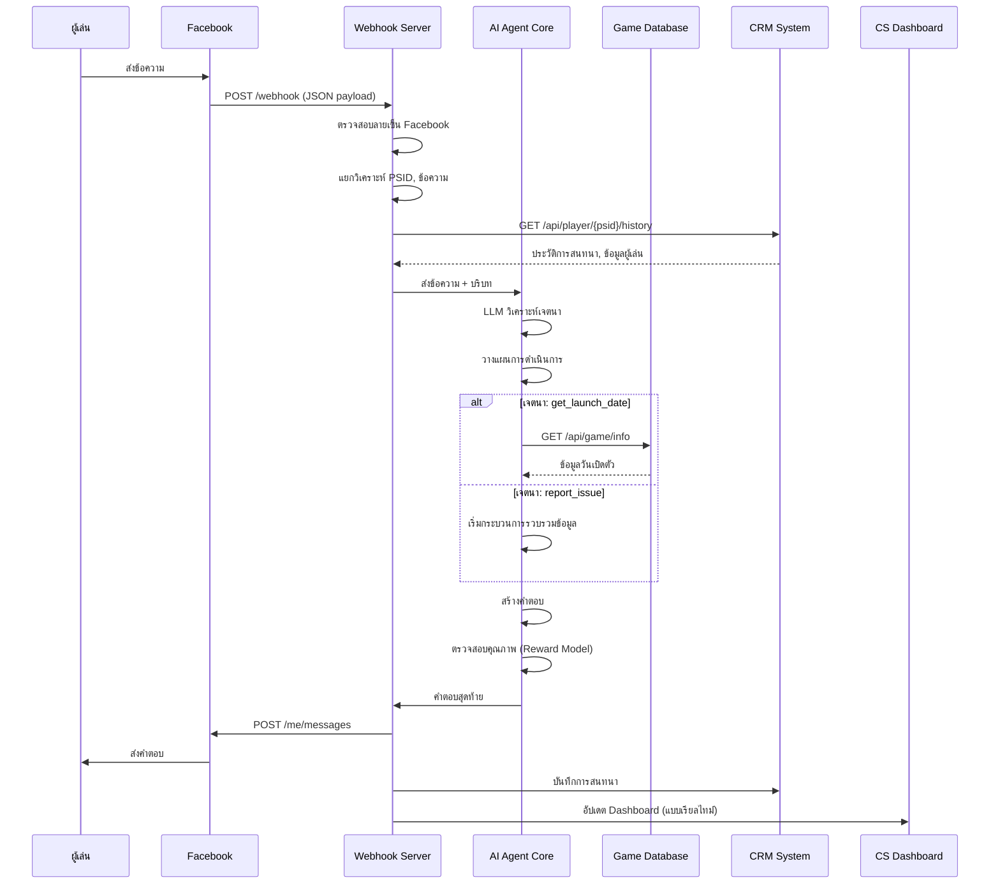

# พิมพ์เขียวระบบ: กระบวนการ เวิร์กโฟลว์ และตรรกะทางธุรกิจ

## ภาพรวม

ส่วนนี้เป็นหัวใจสำคัญของเอกสารสรุปสำหรับนักพัฒนา โดยจะให้รายละเอียดเกี่ยวกับเวิร์กโฟลว์และตรรกะการทำงานของระบบทีละขั้นตอน ซึ่งจะรวมถึงไดอะแกรม (ผังงาน แผนภาพลำดับ) สำหรับการนำไปใช้งานจริง

## 4.1 การยืนยันตัวตนและการเข้าถึง Dashboard (สำหรับทีม CS/CRM)

### ขั้นตอนการเข้าสู่ระบบ (Login Flow)

#### 1. การเข้าสู่หน้า Dashboard
```
เจ้าหน้าที่ CS/CRM → AI Agent Dashboard (เว็บแอปพลิเคชัน)
```

#### 2. การยืนยันตัวตน
```
Dashboard → ระบบ Single Sign-On (SSO) ของบริษัท
          → การตรวจสอบข้อมูลประจำตัว
          → อนุมัติการเข้าถึง
```

#### 3. การเชื่อมต่อ Facebook
```
Dashboard → Facebook Login for Business
          → ขอสิทธิ์การเข้าถึง Pages
          → เจ้าหน้าที่อนุมัติสิทธิ์ (ครั้งเดียว)
          → รับ Access Tokens
```

#### 4. การโหลดข้อมูล Pages
```
Dashboard → Facebook API: GET /me/accounts
          → รับรายชื่อ Fan Pages ที่มีสิทธิ์จัดการ
          → แสดงให้เจ้าหน้าที่เลือก
```

#### 5. การเริ่มต้นการทำงาน
```
เจ้าหน้าที่เลือกเพจ → Dashboard โหลดส่วนติดต่อการสนทนา
                    → เชื่อมต่อกับ AI Agent
                    → พร้อมใช้งาน
```

### โครงสร้าง Dashboard

#### หน้าหลัก (Main Interface):
- **Panel การสนทนา** - แสดงบทสนทนาแบบเรียลไทม์
- **Panel ข้อมูลผู้ใช้** - ประวัติและข้อมูลผู้เล่น
- **Panel RLHF Feedback** - เครื่องมือให้คะแนนและแก้ไข
- **Panel การจัดการ** - สถิติและการตั้งค่า

## 4.2 เวิร์กโฟลว์การประมวลผลข้อความขาเข้าแบบครบวงจร

### ไดอะแกรม Sequence ของกระบวนการ



### รายละเอียดแต่ละขั้นตอน

#### ขั้นที่ 1: การรับข้อความ
```json
// Webhook รับข้อมูลจาก Facebook
{
  "object": "page",
  "entry": [
    {
      "messaging": [
        {
          "sender": {"id": "USER_PSID"},
          "recipient": {"id": "PAGE_ID"},
          "timestamp": 1698388800000,
          "message": {
            "mid": "msg_id",
            "text": "เกมเปิดเมื่อไหร่ครับ?"
          }
        }
      ]
    }
  ]
}
```

#### ขั้นที่ 2: การแยกวิเคราะห์และดึงบริบท
```python
# Pseudo-code สำหรับการประมวลผล
def process_incoming_message(webhook_data):
    # แยกวิเคราะห์ข้อมูล
    user_psid = webhook_data['entry'][0]['messaging'][0]['sender']['id']
    message_text = webhook_data['entry'][0]['messaging'][0]['message']['text']
    
    # ดึงประวัติจาก CRM
    user_history = crm_api.get_player_history(user_psid)
    
    # ดึงข้อมูลการสนทนาล่าสุด
    conversation_context = memory_manager.get_conversation(user_psid)
    
    return {
        'user_psid': user_psid,
        'message': message_text,
        'history': user_history,
        'context': conversation_context
    }
```

#### ขั้นที่ 3: การเรียกใช้ AI Agent
```python
def invoke_agentic_core(processed_data):
    # สร้าง prompt พร้อมบริบท
    prompt = create_contextual_prompt(
        message=processed_data['message'],
        history=processed_data['history'],
        context=processed_data['context']
    )
    
    # เรียกใช้ LLM เพื่อวิเคราะห์เจตนา
    intent_analysis = llm.analyze_intent(prompt)
    
    # วางแผนการดำเนินการ
    action_plan = planner.create_action_plan(intent_analysis)
    
    return action_plan
```

#### ขั้นที่ 4: การดำเนินการตามเครื่องมือ
```python
def execute_action_plan(action_plan):
    results = []
    
    for action in action_plan.actions:
        if action.type == "api_call":
            result = execute_api_call(action)
        elif action.type == "knowledge_search":
            result = search_knowledge_base(action)
        elif action.type == "create_ticket":
            result = create_support_ticket(action)
            
        results.append(result)
    
    return results
```

#### ขั้นที่ 5: การสร้างและส่งคำตอบ
```python
def generate_and_send_response(user_psid, action_results):
    # สังเคราะห์ข้อมูลจากเครื่องมือต่างๆ
    synthesized_data = synthesize_results(action_results)
    
    # สร้างคำตอบด้วย LLM
    response = llm.generate_response(
        data=synthesized_data,
        user_context=user_context,
        language=detect_language(user_psid)
    )
    
    # ตรวจสอบคุณภาพ
    quality_score = reward_model.evaluate(response)
    
    if quality_score > threshold:
        # ส่งคำตอบ
        facebook_api.send_message(user_psid, response)
        
        # บันทึกข้อมูล
        log_conversation(user_psid, response)
    else:
        # สร้างคำตอบใหม่หรือส่งต่อให้มนุษย์
        handle_low_quality_response(user_psid, response)
```

## 4.3 ตรรกะทางธุรกิจสำหรับเจตนาหลัก

### เจตนา: get_launch_date

#### กระบวนการ:
```python
def handle_launch_date_intent(user_context):
    # เรียกใช้ API ฐานข้อมูลเกม
    game_info = game_db_api.get_launch_date()
    
    # จัดรูปแบบวันที่ตามภาษาและวัฒนธรรม
    if user_context.language == 'th':
        formatted_date = format_thai_date(game_info.launch_date)
        template = "เกมจะเปิดให้บริการวันที่ {date} ครับ! 🎮"
    elif user_context.language == 'en':
        formatted_date = format_english_date(game_info.launch_date)
        template = "The game will launch on {date}! 🎮"
    
    return template.format(date=formatted_date)
```

### เจตนา: get_download_link

#### กระบวนการ:
```python
def handle_download_link_intent(user_context):
    # ดึงลิงก์ดาวน์โหลดทุกแพลตฟอร์ม
    download_links = game_db_api.get_download_links()
    
    # สร้าง Quick Reply buttons
    quick_replies = []
    for platform in ['ios', 'android', 'pc']:
        quick_replies.append({
            'content_type': 'text',
            'title': platform.upper(),
            'payload': f'DOWNLOAD_{platform.upper()}'
        })
    
    return {
        'text': get_localized_text('select_platform', user_context.language),
        'quick_replies': quick_replies
    }
```

### เจตนา: report_issue (กระบวนการหลายขั้นตอน)

#### ขั้นตอนที่ 1: รับทราบปัญหา
```python
def handle_report_issue_step1(user_message, user_context):
    # บันทึกปัญหาเบื้องต้น
    issue_session = create_issue_session(user_context.psid)
    issue_session.initial_description = user_message
    
    # ถามคำถามเพื่อชี้แจง
    clarification_questions = generate_clarification_questions(user_message)
    
    return {
        'text': get_localized_text('acknowledge_issue', user_context.language),
        'follow_up': clarification_questions
    }
```

#### ขั้นตอนที่ 2: จัดหมวดหมู่ปัญหา
```python
def handle_report_issue_step2(answers, issue_session):
    # วิเคราะห์คำตอบเพื่อจัดหมวดหมู่
    issue_category = categorize_issue(
        initial_description=issue_session.initial_description,
        clarification_answers=answers
    )
    
    # กำหนดขั้นตอนต่อไปตามหมวดหมู่
    if issue_category == 'billing':
        return handle_billing_issue(issue_session)
    elif issue_category == 'technical':
        return handle_technical_issue(issue_session)
    elif issue_category == 'ban_appeal':
        return handle_ban_appeal(issue_session)
    else:
        return handle_general_support(issue_session)
```

#### ขั้นตอนที่ 3: การดำเนินการตามหมวดหมู่
```python
def handle_technical_issue(issue_session):
    # สำหรับปัญหาเทคนิค
    troubleshooting_steps = get_troubleshooting_steps(
        issue_session.category_details
    )
    
    # ให้ลองแก้ไขเองก่อน
    return {
        'text': 'ลองทำตามขั้นตอนนี้ดูครับ:',
        'steps': troubleshooting_steps,
        'follow_up': 'หากยังไม่ได้ผล กรุณาแจ้งให้เราทราบนะครับ'
    }

def handle_billing_issue(issue_session):
    # สำหรับปัญหาการชำระเงิน - ส่งต่อทันที
    ticket_id = create_priority_ticket(
        psid=issue_session.psid,
        category='billing',
        priority='high',
        description=issue_session.get_full_description()
    )
    
    return {
        'text': f'เรื่องเกี่ยวกับการชำระเงินสำคัญมาก เราได้สร้างตั๋วเลขที่ {ticket_id} ให้คุณแล้ว เจ้าหน้าที่จะติดต่อกลับภายใน 2 ชั่วโมงครับ'
    }
```

## 4.4 ระเบียบการส่งมอบให้เจ้าหน้าที่ที่เป็นมนุษย์ (Human Agent Handover)

### เงื่อนไขการส่งต่อ (Triggers)

#### 1. คำขอโดยตรงจากผู้ใช้
```python
def detect_human_request(message_text):
    human_keywords = [
        'คุยกับคน', 'เจ้าหน้าที่', 'พนักงาน', 
        'talk to human', 'human agent', 'speak to person'
    ]
    
    return any(keyword in message_text.lower() for keyword in human_keywords)
```

#### 2. การตรวจจับอารมณ์เชิงลบ
```python
def detect_negative_emotion(message_text, conversation_history):
    # ใช้ NLP model ตรวจจับอารมณ์
    emotion_score = emotion_analyzer.analyze(message_text)
    
    # พิจารณาบริบทการสนทนา
    frustration_indicators = count_frustration_indicators(conversation_history)
    
    return (emotion_score.negativity > 0.7 or 
            frustration_indicators > 3)
```

#### 3. Agent ไม่สามารถแก้ไขปัญหาได้
```python
def detect_agent_confusion(conversation_session):
    failed_attempts = conversation_session.count_failed_resolutions()
    repeat_issues = conversation_session.count_repeated_issues()
    
    return (failed_attempts >= 2 or repeat_issues >= 3)
```

#### 4. คำสำคัญที่มีความสำคัญสูง
```python
def detect_critical_keywords(message_text):
    critical_keywords = [
        'ขอเงินคืน', 'refund', 'กฎหมาย', 'legal', 
        'ถูกแบน', 'banned', 'โกง', 'cheat',
        'ข้อมูลส่วนตัว', 'privacy', 'บัญชีถูกแฮก'
    ]
    
    return any(keyword in message_text.lower() for keyword in critical_keywords)
```

### เวิร์กโฟลว์การส่งต่อ

#### ขั้นตอนการส่งต่อ:
```python
def initiate_handover(user_psid, reason, conversation_context):
    # 1. สร้างตั๋วสนับสนุน
    ticket = create_support_ticket(
        psid=user_psid,
        reason=reason,
        conversation_log=conversation_context.get_full_log(),
        ai_analysis=conversation_context.get_ai_analysis()
    )
    
    # 2. ใช้ Handover Protocol
    handover_result = facebook_api.pass_thread_control(
        recipient_psid=user_psid,
        target_app_id=human_agent_app_id,
        metadata=f"Handover reason: {reason}, Ticket: {ticket.id}"
    )
    
    # 3. ส่งข้อความแจ้งผู้ใช้
    notification_message = create_handover_notification(
        reason=reason,
        ticket_id=ticket.id,
        estimated_wait_time=calculate_wait_time()
    )
    
    facebook_api.send_message(user_psid, notification_message)
    
    # 4. แจ้งเตือน CS Dashboard
    notify_cs_dashboard(ticket.id, user_psid, reason)
    
    return ticket.id
```

#### ข้อความแจ้งผู้ใช้:
```python
def create_handover_notification(reason, ticket_id, estimated_wait_time):
    templates = {
        'user_request': 'เรียบร้อยครับ เราได้เชื่อมต่อคุณไปยังเจ้าหน้าที่ที่เป็นคนแล้ว',
        'complex_issue': 'เรื่องนี้ต้องการความช่วยเหลือที่เฉพาะทางครับ เราได้สร้างตั๋วเลขที่ {ticket_id} ให้คุณแล้ว',
        'negative_emotion': 'เราเข้าใจความรู้สึกของคุณครับ ขอให้เจ้าหน้าที่ที่เป็นคนมาช่วยเหลือคุณนะครับ',
        'critical_issue': 'เรื่องนี้สำคัญมาก เราได้ส่งต่อให้เจ้าหน้าที่ผู้เชี่ยวชาญแล้ว จะติดต่อกลับภายใน {wait_time}'
    }
    
    return templates[reason].format(
        ticket_id=ticket_id, 
        wait_time=estimated_wait_time
    )
```

## 4.5 การจัดการสถานะการสนทนา (Conversation State Management)

### โครงสร้าง Session State

#### การเก็บข้อมูล Session:
```python
class ConversationSession:
    def __init__(self, user_psid):
        self.psid = user_psid
        self.session_id = generate_session_id()
        self.start_time = datetime.now()
        self.current_intent = None
        self.context = {}
        self.conversation_log = []
        self.ai_confidence_scores = []
        self.issue_session = None
        self.handover_status = 'active'  # active, pending_handover, handed_over
        
    def add_message(self, sender, message, intent=None, confidence=None):
        entry = {
            'timestamp': datetime.now(),
            'sender': sender,  # 'user' or 'bot'
            'message': message,
            'intent': intent,
            'confidence': confidence
        }
        self.conversation_log.append(entry)
        
    def update_context(self, key, value):
        self.context[key] = {
            'value': value,
            'timestamp': datetime.now()
        }
        
    def get_recent_context(self, minutes=30):
        cutoff_time = datetime.now() - timedelta(minutes=minutes)
        recent_context = {}
        
        for key, data in self.context.items():
            if data['timestamp'] > cutoff_time:
                recent_context[key] = data['value']
                
        return recent_context
```

### การจัดการ Multi-Step Conversations

#### สำหรับปัญหาที่ซับซ้อน:
```python
class IssueResolutionFlow:
    def __init__(self, session):
        self.session = session
        self.current_step = 'initial'
        self.collected_data = {}
        self.resolution_attempts = []
        
    def process_step(self, user_input):
        if self.current_step == 'initial':
            return self.handle_initial_report(user_input)
        elif self.current_step == 'collecting_details':
            return self.handle_detail_collection(user_input)
        elif self.current_step == 'providing_solution':
            return self.handle_solution_feedback(user_input)
        elif self.current_step == 'verifying_resolution':
            return self.handle_resolution_verification(user_input)
    
    def handle_initial_report(self, issue_description):
        self.collected_data['initial_issue'] = issue_description
        
        # วิเคราะห์ปัญหาเบื้องต้น
        analysis = analyze_issue_type(issue_description)
        
        # กำหนดคำถามที่ต้องถามต่อ
        follow_up_questions = generate_questions(analysis)
        
        self.current_step = 'collecting_details'
        return {
            'response': 'ขออนุญาตถามรายละเอียดเพิ่มเติมนะครับ',
            'questions': follow_up_questions
        }
```

## 4.6 การติดตามและวิเคราะห์ประสิทธิภาพ

### เมตริกที่ติดตาม

#### 1. ประสิทธิภาพ AI:
```python
class AIPerformanceMetrics:
    def __init__(self):
        self.intent_accuracy = MetricTracker('intent_accuracy')
        self.response_quality = MetricTracker('response_quality') 
        self.resolution_rate = MetricTracker('resolution_rate')
        self.handover_rate = MetricTracker('handover_rate')
        
    def record_interaction(self, session):
        # บันทึกความแม่นยำในการจำแนกเจตนา
        if session.has_human_feedback():
            accuracy = calculate_intent_accuracy(session)
            self.intent_accuracy.record(accuracy)
            
        # บันทึกคุณภาพการตอบสนอง
        if session.has_quality_rating():
            quality_score = session.get_quality_rating()
            self.response_quality.record(quality_score)
```

#### 2. ประสิทธิภาพธุรกิจ:
```python
class BusinessMetrics:
    def __init__(self):
        self.csat_score = MetricTracker('csat')
        self.resolution_time = MetricTracker('resolution_time')
        self.cost_per_interaction = MetricTracker('cost_per_interaction')
        
    def calculate_daily_metrics(self):
        return {
            'total_conversations': self.count_daily_conversations(),
            'ai_resolved': self.count_ai_resolutions(),
            'human_escalations': self.count_human_handovers(),
            'average_csat': self.csat_score.get_average(),
            'cost_savings': self.calculate_cost_savings()
        }
```

### Dashboard แบบเรียลไทม์

#### ข้อมูลที่แสดงใน CS Dashboard:
```python
def generate_dashboard_data():
    return {
        'active_conversations': get_active_conversations(),
        'pending_handovers': get_pending_handovers(),
        'recent_escalations': get_recent_escalations(),
        'ai_performance': {
            'intent_accuracy': get_current_accuracy(),
            'response_quality': get_average_quality(),
            'resolution_rate': get_resolution_rate()
        },
        'alerts': get_active_alerts()
    }
```

## สรุป

พิมพ์เขียวระบบนี้ให้รายละเอียดที่ครบถ้วนสำหรับการนำไปใช้งานจริง โดยครอบคลุม:

### องค์ประกอบหลัก:
1. **การจัดการ Authentication และ Authorization**
2. **เวิร์กโฟลว์การประมวลผลข้อความแบบครบวงจร** 
3. **ตรรกะทางธุรกิจสำหรับเจตนาต่างๆ**
4. **ระบบการส่งต่อให้เจ้าหน้าที่มนุษย์**
5. **การจัดการสถานะการสนทนา**
6. **การติดตามและวิเคราะห์ประสิทธิภาพ**

### ข้อดีของแนวทางนี้:
- **ความยืดหยุ่น** - สามารถปรับเปลี่ยนตรรกะได้ง่าย
- **ความสามารถในการขยายขนาด** - รองรับการเติบโตได้
- **การติดตามผล** - มีระบบ monitoring ที่ครบถ้วน
- **ประสบการณ์ผู้ใช้** - การส่งต่อที่ราบรื่น

การติดตั้งใช้งานตามพิมพ์เขียวนี้จะช่วยให้ทีมพัฒนาสามารถสร้างระบบ AI Agentic ที่มีประสิทธิภาพและใช้งานได้จริงในสภาพแวดล้อมการผลิต

---

**หมายเหตุ**: เอกสารนี้เป็นส่วนหนึ่งของชุดเอกสารออกแบบระบบ AI Agentic ที่ครบถ้วน สำหรับรายละเอียดเพิ่มเติม โปดดูเอกสารอื่นๆ ในโฟลเดอร์ `docs/`