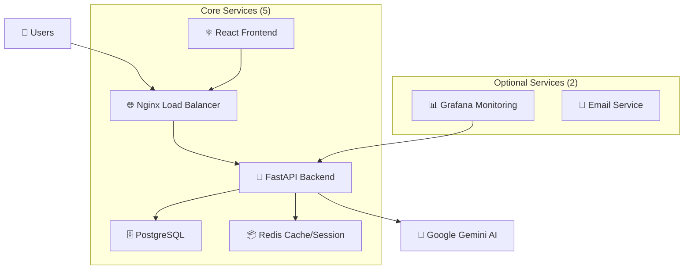

# 🚀 Technology Stack Recommendation & Optimization

**Date**: October 17, 2025  
**Project**: Enterprise CRM + AI Chatbot Platform  
**Focus**: Simplified Architecture with Optimal Technology Selection

---

## 🎯 **Current Challenge Analysis**

### **🔍 Current 11-Service Stack Issues:**
```
❌ ปัญหาปัจจุบัน:
1. PostgreSQL + MongoDB + Redis = 3 databases (ซับซ้อน)
2. Node.js Backend + React Frontend = JavaScript ecosystem
3. Nginx + Prometheus + Grafana + ELK = 4 monitoring services
4. MailHog = Development-only service
5. รวม 11 services = Resource intensive + Complex deployment
```

### **🎯 เป้าหมายใหม่:**
- **Simplify Infrastructure** โดยไม่เสีย functionality
- **Optimize Performance** และ resource usage  
- **Maintain Enterprise Features** แต่ลดความซับซ้อน
- **เลือก Primary Technology** (Python vs Node.js)

---

## 🏗️ **Recommended Technology Stack**

### **🐍 Option 1: Python-Centric Stack (แนะนำ)**



#### **🎯 Core Services (7 Services - Optimized)**
```yaml
services:
  # 1. Database Layer
  postgresql:
    image: postgres:15-alpine
    purpose: "Primary database with JSON support (replaces MongoDB)"
    
  # 2. Cache & Session Layer  
  redis:
    image: redis:7-alpine
    purpose: "Caching, sessions, real-time data, queues"
    
  # 3. Backend API Layer
  fastapi-backend:
    build: ./backend
    purpose: "Python FastAPI + SQLAlchemy + Celery"
    
  # 4. Frontend Layer
  react-frontend:
    build: ./frontend  
    purpose: "React + TypeScript + Vite"
    
  # 5. Reverse Proxy
  nginx:
    image: nginx:alpine
    purpose: "Load balancing + SSL termination + Static files"
    
  # 6. Monitoring
  grafana:
    image: grafana/grafana:latest
    purpose: "Metrics visualization + Alerting"
    
  # 7. Background Tasks
  celery-worker:
    build: ./backend
    purpose: "Async tasks + AI processing + Email"
```

#### **🔧 Python Backend Stack:**
```python
# Core Dependencies
FastAPI          # Modern, fast web framework
SQLAlchemy      # ORM with PostgreSQL
Pydantic        # Data validation
Celery          # Background tasks
Redis-py        # Redis client
Alembic         # Database migrations
Pytest          # Testing

# AI & ML Libraries
google-generativeai  # Gemini AI
langchain           # AI framework
sentence-transformers # Embeddings
numpy              # Scientific computing

# Enterprise Features
python-jose        # JWT handling
bcrypt            # Password hashing
prometheus-client # Metrics
structlog         # Logging
```
- เครื่องมือพัฒนาที่ครบถ้วน
- การสนับสนุนหลายช่องทาง
- ความปลอดภัยระดับองค์กร

**ข้อเสีย:**
- ต้องใช้ Azure เป็นหลัก
- ความซับซ้อนในการตั้งค่า
- ค่าใช้จ่ายสำหรับองค์กร

## การเปรียบเทียบชุดเทคโนโลยี

| คุณสมบัติ | Rasa | Google Dialogflow CX | Microsoft Bot Framework |
|-----------|------|---------------------|------------------------|
| **การควบคุมข้อมูลและความเป็นส่วนตัว** | เป็นเจ้าของข้อมูลทั้งหมด สามารถติดตั้งบนเซิร์ฟเวอร์ของตนเอง (On-premise) หรือบนคลาวด์ส่วนตัวได้ | จำกัด ข้อมูลถูกประมวลผลบน Google Cloud และอยู่ภายใต้นโยบายข้อมูลของ Google | จัดการภายใน Azure ข้อมูลจะอยู่ในระบบนิเวศของ Azure |
| **การปรับแต่งแบบจำลอง** | สูง เป็นโอเพนซอร์สทำให้สามารถปรับแต่ง NLU pipelines และนโยบายการสนทนาได้ | ต่ำ แบบจำลองพื้นฐานเป็น "กล่องดำ" การปรับแต่งจำกัด | ปานกลาง อนุญาตให้ปรับแต่งผ่าน LUIS แต่แบบจำลองหลักถูกจัดการโดย Microsoft |
| **ตัวเลือกการติดตั้ง** | On-premise, Private Cloud, Public Cloud | Google Cloud เท่านั้น | Azure Cloud เท่านั้น |
| **ระยะเวลาในการเรียนรู้** | สูง ต้องการความเชี่ยวชาญด้าน Python และ MLOps อย่างมาก | ปานกลาง เครื่องมือสร้างแบบภาพทำให้ผู้ใช้ที่ไม่ใช่สายเทคนิคเข้าถึงได้ง่าย | สูง เน้นการใช้ SDK ต้องการทักษะของนักพัฒนาที่แข็งแกร่ง |
| **การเชื่อมต่อ** | ยืดหยุ่นสูงผ่านการเรียก API และ SDK ที่กำหนดเอง | เชื่อมต่อกับบริการของ Google Cloud ได้ดี | เชื่อมต่อกับระบบนิเวศของ Microsoft ได้อย่างลึกซึ้ง |
| **รูปแบบค่าใช้จ่าย** | โอเพนซอร์สฟรี เวอร์ชันองค์กรมีค่าลิขสิทธิ์ ต้องการการลงทุนด้านโครงสร้างพื้นฐาน | จ่ายตามการใช้งาน ตามจำนวนคำขอ อาจมีค่าใช้จ่ายสูงเมื่อมีปริมาณมาก | จ่ายตามการใช้งานสำหรับบริการของ Azure |

## คำแนะนำสุดท้าย: Rasa

จากการวิเคราะห์ ขอแนะนำอย่างยิ่งให้ใช้เฟรมเวิร์ก **Rasa**

### เหตุผลสนับสนุน

#### 1. อธิปไตยทางข้อมูล (Data Sovereignty)

สำหรับบริษัทเกม **ข้อมูลผู้เล่นถือเป็นทรัพย์สินที่สำคัญอย่างยิ่ง** 

ความสามารถในการติดตั้ง Rasa บนเซิร์ฟเวอร์ของตนเอง (On-premise) ทำให้:
- สามารถควบคุมและเป็นเจ้าของข้อมูลได้อย่างสมบูรณ์
- ลดความเสี่ยงด้านความเป็นส่วนตัว
- ปฏิบัติตามกฎระเบียบคุมครองข้อมูลต่างๆ

#### 2. การปรับแต่งเชิงลึก (Deep Customization)

**โดเมนของเกมมีภาษาที่เป็นเอกลักษณ์และโฟลว์การสนทนาที่ซับซ้อน**

ลักษณะที่เป็นโอเพนซอร์สของ Rasa ช่วยให้:
- สร้างแบบจำลอง NLU ที่ปรับแต่งมาอย่างดี
- เพื่อทำความเข้าใจศัพท์สแลงของเกมเมอร์
- สร้างระบบการจัดการบทสนทนาที่จัดการกับการโต้ตอบที่ซับซ้อนและหลายขั้นตอน
- ได้ดีกว่าโฟลว์ที่อิงตามบริบทที่ค่อนข้างตายตัวของแพลตฟอร์มคลาวด์

#### 3. สินทรัพย์เชิงกลยุทธ์ระยะยาว (Long-Term Strategic Asset)

การสร้างระบบบน Rasa ไม่ใช่แค่การสร้างแชทบอท แต่เป็น**การพัฒนาแพลตฟอร์ม AI สนทนาที่เป็นกรรมสิทธิ์และปรับแต่งมาอย่างดี**

ประโยชน์:
- กลายเป็นความได้เปรียบในการแข่งขันที่ไม่สามารถลอกเลียนแบบได้ง่าย
- โดยคู่แข่งที่ใช้โซลูชันคลาวด์สำเร็จรูป
- การลงทุนในทีมภายในองค์กรยังเป็นการสร้างความเชี่ยวชาญที่มีค่าภายในบริษัทอีกด้วย

## แนวทางการติดตั้ง Rasa

### โครงสร้างโปรเจค

```
ai-agentic-system/
├── rasa/
│   ├── actions/
│   │   ├── __init__.py
│   │   ├── actions.py
│   │   └── facebook_integration.py
│   ├── data/
│   │   ├── nlu/
│   │   │   ├── intents_th.yml
│   │   │   ├── intents_en.yml
│   │   │   ├── intents_zh.yml
│   │   │   └── intents_id.yml
│   │   ├── rules/
│   │   └── stories/
│   ├── models/
│   ├── config.yml
│   ├── domain.yml
│   └── endpoints.yml
├── services/
│   ├── webhook_server/
│   ├── game_db_api/
│   ├── crm_integration/
│   └── rlhf_service/
├── dashboard/
│   ├── frontend/
│   └── backend/
└── infrastructure/
    ├── docker/
    ├── kubernetes/
    └── monitoring/
```

### การตั้งค่า Configuration

#### config.yml (ตัวอย่าง):
```yaml
version: "3.1"

pipeline:
  - name: "WhitespaceTokenizer"
  - name: "RegexFeaturizer"
  - name: "LexicalSyntacticFeaturizer"
  - name: "CountVectorFeaturizer"
  - name: "CountVectorFeaturizer"
    analyzer: char_wb
    min_ngram: 1
    max_ngram: 4
  - name: "DIETClassifier"
    epochs: 100
    constrain_similarities: true
  - name: "EntitySynonymMapper"
  - name: "ResponseSelector"
    epochs: 100
    constrain_similarities: true
  - name: "FallbackClassifier"
    threshold: 0.3
    ambiguity_threshold: 0.1

policies:
  - name: MemoizationPolicy
  - name: RulePolicy
  - name: UnexpecTEDIntentPolicy
    max_history: 5
    epochs: 100
  - name: TEDPolicy
    max_history: 5
    epochs: 100
    constrain_similarities: true
```

### การจัดการหลายภาษา

#### โครงสร้างข้อมูลฝึก:
```yaml
# intents_th.yml
version: "3.1"
nlu:
- intent: get_launch_date
  examples: |
    - เกมเปิดเมื่อไหร่ครับ
    - วันเปิดเกมคือเมื่อไหร่
    - เกมเปิดให้เล่นวันไหนครับ
    - เมื่อไหร่จะได้เล่นเกม

- intent: get_download_link  
  examples: |
    - ดาวน์โหลดเกมได้ที่ไหน
    - ขอลิงก์ดาวน์โหลดหน่อย
    - เกมโหลดได้จากไหนครับ
```

### การเชื่อมต่อกับ Facebook

#### Custom Action สำหรับ Facebook:
```python
# actions/facebook_integration.py
from typing import Any, Text, Dict, List
from rasa_sdk import Action, Tracker
from rasa_sdk.executor import CollectingDispatcher
import requests

class ActionSendFacebookMessage(Action):
    def name(self) -> Text:
        return "action_send_facebook_message"
    
    def run(self, dispatcher: CollectingDispatcher,
            tracker: Tracker,
            domain: Dict[Text, Any]) -> List[Dict[Text, Any]]:
        
        # ดึง PSID และข้อความ
        user_psid = tracker.get_slot("user_psid")
        message = tracker.latest_message.get('text')
        
        # ส่งข้อความผ่าน Facebook Send API
        facebook_response = self.send_to_facebook(user_psid, message)
        
        return []
    
    def send_to_facebook(self, user_psid: str, message: str):
        # Implementation สำหรับส่งข้อความไป Facebook
        pass
```

### การติดตั้งและการรัน

#### Docker Configuration:
```dockerfile
# Dockerfile
FROM rasa/rasa:3.6.0-full

COPY . /app
WORKDIR /app

USER root
RUN pip install -r requirements-actions.txt

USER 1001
```

#### Docker Compose:
```yaml
version: '3.8'
services:
  rasa:
    build: .
    ports:
      - "5005:5005"
    volumes:
      - ./models:/app/models
    command: run --enable-api --cors "*"
    
  action-server:
    build: .
    ports:
      - "5055:5055"
    command: run actions
    
  redis:
    image: redis:6-alpine
    ports:
      - "6379:6379"
```

## การวางแผนการพัฒนา

### Phase 1: Setup และ Basic Bot (4-6 สัปดาห์)
- ติดตั้ง Rasa environment
- สร้าง basic intents และ responses
- การเชื่อมต่อกับ Facebook Webhooks
- ทดสอบระบบพื้นฐาน

### Phase 2: Advanced Features (6-8 สัปดาหห์)
- การเชื่อมต่อกับ Game DB และ CRM APIs
- การจัดการ multi-turn conversations
- การสร้าง custom actions
- การจัดการหลายภาษา

### Phase 3: RLHF Integration (8-10 สัปดาห์)
- การสร้าง feedback collection system
- การติดตั้ง reward model training
- การเชื่อมต่อกับ CS Dashboard
- การทดสอบและปรับปรุง

### Phase 4: Production Deployment (4-6 สัปดาห์)
- การตั้งค่า production infrastructure
- การติดตั้ง monitoring และ logging
- การทดสอบ load และ performance
- การเปิดตัวอย่างเป็นทางการ

## สรุป

การเลือกใช้ **Rasa** เป็นการตัดสินใจเชิงกลยุทธ์ที่จะช่วยให้บริษัทสามารถ:

1. **ควบคุมข้อมูลได้อย่างสมบูรณ์** - สำคัญสำหรับธุรกิจเกม
2. **ปรับแต่งได้ตามต้องการ** - รองรับความซับซ้อนของโดเมนเกม  
3. **สร้างสินทรัพย์ระยะยาว** - ไม่ต้องพึ่งพาผู้ให้บริการภายนอก
4. **ขยายขนาดได้** - รองรับการเติบโตในอนาคต

แม้ว่าจะต้องลงทุนด้านความเชี่ยวชาญและเวลาในการพัฒนามากกว่า แต่ผลตอบแทนระยะยาวจะคุ้มค่ากับการลงทุนเหล่านี้

---

**หมายเหตุ**: เอกสารนี้เป็นส่วนหนึ่งของชุดเอกสารออกแบบระบบ AI Agentic ที่ครบถ้วน สำหรับรายละเอียดเพิ่มเติม โปดดูเอกสารอื่นๆ ในโฟลเดอร์ `docs/`